# Technical Specification

# 0. Agent Action Plan

## 0.1 Intent Clarification


### 0.1.1 Core Feature Objective

Based on the prompt, the Blitzy platform understands that the new feature requirement is to **build BCC (Blitzy's C Compiler) from scratch** — a complete, self-contained, zero-external-dependency C compilation toolchain implemented in Rust (2021 Edition) that cross-compiles C source code into native Linux ELF executables and shared objects for four target architectures: **x86-64, i686, AArch64, and RISC-V 64**.

The feature requirements, restated with enhanced clarity, are:

- **Full C11 Compiler Pipeline:** Implement a complete compilation pipeline spanning 10+ phases — from preprocessing (with PUA encoding for non-UTF-8 round-tripping, paint-marker recursion protection) through lexical analysis, parsing (with extensive GCC extension support), semantic analysis, IR lowering, SSA construction via "alloca-then-promote," optimization passes, phi-elimination, and multi-architecture code generation
- **Self-Contained Toolchain ("Standalone Backend Mode"):** The compiler must include its own built-in assembler and built-in linker for all four target architectures, producing ELF binaries (ET_EXEC and ET_DYN) without invoking any external toolchain component (no `as`, no `ld`, no `llvm-mc`)
- **Zero-Dependency Mandate:** No external Rust crates may be added to `Cargo.toml`. Every capability — assembler, linker, DWARF emitter, PIC relocation handling, FxHash, long-double software math — must be implemented internally
- **Multi-Architecture Code Generation:** Emit correct machine code for x86-64, i686, AArch64, and RISC-V 64, with architecture-specific ABI conformance, calling conventions, and instruction selection
- **GCC Extension Coverage:** Support a comprehensive set of GCC attributes, language extensions, builtins, and inline assembly (AT&T syntax with full constraint support, `asm volatile`, `asm goto`, named operands) as required by the Linux kernel source
- **Security-Hardened Code Generation (x86-64):** Implement retpoline generation (`-mretpoline`), Intel CET/IBT (`-fcf-protection`), and stack guard page probing for frames exceeding 4,096 bytes
- **PIC & Shared Library Support:** Full `-fPIC` code generation and `-shared` linking with GOT/PLT relocation emission, `.dynamic`/`.dynsym`/`.rela.dyn`/`.rela.plt`/`.gnu.hash` section generation, and symbol visibility control across all four architectures
- **DWARF Debug Information:** Emit DWARF v4 debug sections (`.debug_info`, `.debug_abbrev`, `.debug_line`, `.debug_str`) at `-O0` for source file/line mapping and local variable locations
- **Linux Kernel 6.9 Boot:** The ultimate validation target — compile and boot the Linux kernel 6.9 (RISC-V configuration) to userspace in QEMU, exercising the full C language surface, GCC extensions, preprocessor edge cases, inline assembly, and linker correctness simultaneously

**Implicit requirements detected:**

- A CLI driver binary (`bcc`) must be produced that accepts GCC-compatible flags (`-o`, `-c`, `-S`, `-E`, `-g`, `-O0`, `-fPIC`, `-shared`, `-mretpoline`, `-fcf-protection`, `--target=<arch>`, `-I`, `-D`, `-L`, `-l`)
- A 64 MiB worker thread stack must be configured and a 512-limit recursion depth enforced to handle deeply nested kernel macro expansions
- The FxHasher implementation (`src/common/fx_hash.rs`) must replace `std::collections::HashMap` hashing for performance-critical symbol tables and lookup structures
- Software long-double arithmetic (`src/common/long_double.rs`) is required because the zero-dependency mandate forbids linking against external math libraries
- RAII-based temporary file management (`src/common/temp_files.rs`) is needed for intermediate object files during multi-file compilation
- A dual type system (`src/common/types.rs` and `src/common/type_builder.rs`) is required — one representing C language types and one representing target-machine types for ABI correctness
- The `_Atomic` type qualifier must be supported at the storage/representation level, with actual atomic operations potentially delegating to libatomic at link time
- An extension manifest must be maintained during the kernel build phase to track GCC extensions that are discovered and implemented beyond the initial §4.3 list

### 0.1.2 Special Instructions and Constraints

**Critical Directives:**

- **Zero-Dependency Philosophy:** This is a non-negotiable architectural constraint. The `[dependencies]` section of `Cargo.toml` must remain empty. All functionality is hand-implemented in Rust
- **"Alloca-then-Promote" SSA Architecture:** The IR lowering phase must initially place all local variables in memory (alloca), then the mem2reg pass promotes eligible allocas to SSA virtual registers. This is the mandated architectural pattern (matching LLVM's approach)
- **Standalone Backend:** Unlike the existing tech spec's assumption (§5.1.4, Constraint C-003) that a system linker would be used, the user's requirements explicitly override this — BCC includes its own assembler and linker. No external toolchain invocation occurs
- **Resource Constraints:** 64 MiB worker thread stack and 512-limit recursion depth must be enforced
- **Platform Restriction:** Strictly Linux-only output; exclusively ELF format (ET_EXEC and ET_DYN)
- **Sequential Checkpoint Validation:** All checkpoints (1–6) are strictly sequential hard gates. Failure at any gate halts forward progress. Checkpoint 7 (stretch targets: SQLite, Redis, PostgreSQL, FFmpeg) is optional
- **Wall-Clock Ceiling:** Total kernel build time must not exceed 5× GCC-equivalent on the same hardware

**Architectural Requirements:**

- Follow the ingestion order specified in §3 of the user prompt for module interdependency management
- The `ArchCodegen` trait (`src/backend/traits.rs`) provides the architecture abstraction layer — each target implements this trait
- Backend validation order is fixed: x86-64 first, then i686, AArch64, RISC-V 64
- The preprocessor paint-marker system is architecturally distinct from circular `#include` detection — it operates at the token/macro level during Phase 2 expansion

**User Examples Preserved:**

- User Example — Hello World test: `./bcc -o hello hello.c && ./hello` → stdout: `Hello, World!\n`, exit code 0
- User Example — Stack probe test: `void f(void) { char buf[8192]; buf[0] = 1; }` — disassembly MUST show a probe loop before the stack pointer adjustment
- User Example — Retpoline validation: function containing `(*fptr)()` call → call instruction targets `__x86_indirect_thunk_*`, not the pointer directly
- User Example — Kernel boot validation: QEMU invocation with minimal `/init` (static binary printing `USERSPACE_OK\n` and calling reboot) packed into initramfs
- User Example — Recursive macro test: `#define A A` and `int x = A;` → terminates in <5 seconds, no hang

### 0.1.3 Technical Interpretation

These feature requirements translate to the following technical implementation strategy:

- To **implement the core compilation pipeline**, we will create the entire `src/` directory tree from scratch following a layered architecture: `src/common/` (infrastructure), `src/frontend/` (preprocessor, lexer, parser, sema), `src/ir/` (lowering, mem2reg, phi-elimination), `src/passes/` (optimization), and `src/backend/` (code generation, assemblers, linkers)
- To **enforce the zero-dependency mandate**, we will implement all hash functions (FxHash), encoding utilities (PUA/UTF-8), math operations (long-double software arithmetic), ELF writing, DWARF emission, assemblers, and linkers as internal Rust modules without any external crate imports
- To **support four target architectures**, we will define the `ArchCodegen` trait in `src/backend/traits.rs` and implement it in four architecture-specific modules: `src/backend/x86_64/`, `src/backend/i686/`, `src/backend/aarch64/`, and `src/backend/riscv64/`, each containing architecture-specific assembler and linker sub-modules
- To **handle GCC extensions**, we will extend the parser (`src/frontend/parser/`) with GCC-specific grammar rules (statement expressions, typeof, computed gotos, case ranges, etc.) and extend the semantic analyzer (`src/frontend/sema/`) with attribute handling, builtin evaluation, and inline assembly constraint validation
- To **implement SSA via alloca-then-promote**, we will create `src/ir/lowering/` to initially place all local variables as alloca instructions, then `src/ir/mem2reg/` to construct SSA form by promoting eligible allocas to virtual registers using dominance frontier computation
- To **produce security-hardened code for x86-64**, we will implement retpoline thunk generation, `endbr64` emission, and stack probe loops as code generation passes conditioned on CLI flags (`-mretpoline`, `-fcf-protection`)
- To **build and boot the Linux kernel**, we will iteratively compile kernel sub-gates (`init/main.o`, `kernel/sched/core.o`, `mm/memory.o`, `fs/read_write.o`), diagnose and implement any missing features surfaced by compilation failures, and validate the final `vmlinux` ELF through QEMU boot to userspace


## 0.2 Repository Scope Discovery


### 0.2.1 Comprehensive File Analysis

The current repository is **greenfield** — it contains only a single `README.md` file describing the project as "Blitzy's greenfield C-compiler project." The entire source tree must be created from scratch. The following analysis maps every file and directory that must be produced, organized by the pipeline ingestion order specified in the user's requirements.

**Existing Files to Modify:**

| File | Action | Purpose |
|------|--------|---------|
| `README.md` | MODIFY | Update with comprehensive project documentation, build instructions, usage examples, architecture overview, and supported flags |

**Project Root — Configuration Files to Create:**

| File | Action | Purpose |
|------|--------|---------|
| `Cargo.toml` | CREATE | Rust package manifest — `edition = "2021"`, `name = "bcc"`, zero dependencies, release profile optimizations, 64 MiB stack configuration |
| `Cargo.lock` | AUTO-GENERATED | Lock file produced by `cargo build` (committed for binary crates) |
| `.cargo/config.toml` | CREATE | Cargo configuration for build settings, target defaults, and stack size via `RUST_MIN_STACK` or rustflags |
| `.gitignore` | CREATE | Ignore `target/`, `*.o`, `*.so`, `*.elf`, temporary build artifacts |
| `rustfmt.toml` | CREATE | Code formatting configuration for consistent style |
| `clippy.toml` | CREATE | Clippy lint configuration |

**Infrastructure Layer — `src/common/`:**

| File | Action | Purpose |
|------|--------|---------|
| `src/main.rs` | CREATE | CLI entry point — argument parsing, driver orchestration, worker thread spawning with 64 MiB stack |
| `src/lib.rs` | CREATE | Library root — public API surface, module declarations |
| `src/common/mod.rs` | CREATE | Common module declarations |
| `src/common/fx_hash.rs` | CREATE | FxHasher implementation — fast, non-cryptographic hash for symbol tables and lookup maps |
| `src/common/encoding.rs` | CREATE | PUA/UTF-8 encoding — Private Use Area (U+E080–U+E0FF) mapping for non-UTF-8 byte round-tripping |
| `src/common/long_double.rs` | CREATE | Software long-double arithmetic — IEEE 754 extended-precision math without external libraries |
| `src/common/temp_files.rs` | CREATE | RAII-based temporary file management for intermediate compilation artifacts |
| `src/common/types.rs` | CREATE | Dual type system — C language types and target-machine ABI types |
| `src/common/type_builder.rs` | CREATE | Type construction API — builder pattern for constructing complex C and machine types |
| `src/common/diagnostics.rs` | CREATE | Multi-error diagnostic reporting engine — spans, source locations, severity levels, formatting |
| `src/common/source_map.rs` | CREATE | Source file tracking — file IDs, line/column mapping, `#line` directive handling |
| `src/common/string_interner.rs` | CREATE | String interning for identifiers, keywords, and string literals using FxHash |
| `src/common/target.rs` | CREATE | Target triple definitions and architecture-specific constants for x86-64, i686, AArch64, RISC-V 64 |

**Frontend Pipeline — `src/frontend/`:**

| File | Action | Purpose |
|------|--------|---------|
| `src/frontend/mod.rs` | CREATE | Frontend module declarations |
| `src/frontend/preprocessor/mod.rs` | CREATE | Preprocessor module — Phase 1 (trigraphs, line splicing) and Phase 2 (macro expansion, `#include`, `#define`, `#if`/`#ifdef`/`#elif`/`#else`/`#endif`, `#pragma`) |
| `src/frontend/preprocessor/directives.rs` | CREATE | Directive handling — `#include` search paths, `#define`/`#undef`, conditional compilation |
| `src/frontend/preprocessor/macro_expander.rs` | CREATE | Macro expansion engine with paint-marker recursion protection for self-referential macros |
| `src/frontend/preprocessor/paint_marker.rs` | CREATE | Token-level paint marker implementation — marks expanded macro tokens to suppress re-expansion |
| `src/frontend/preprocessor/include_handler.rs` | CREATE | `#include` file resolution — system paths, user paths, include guards, circular detection |
| `src/frontend/preprocessor/token_paster.rs` | CREATE | `##` token pasting and `#` stringification operators |
| `src/frontend/preprocessor/expression.rs` | CREATE | Preprocessor constant expression evaluation for `#if`/`#elif` |
| `src/frontend/preprocessor/predefined.rs` | CREATE | Predefined macros — `__FILE__`, `__LINE__`, `__DATE__`, `__TIME__`, `__STDC__`, `__STDC_VERSION__`, architecture-specific defines |
| `src/frontend/lexer/mod.rs` | CREATE | Lexer module — Phase 3 tokenization |
| `src/frontend/lexer/token.rs` | CREATE | Token type definitions — keywords, identifiers, literals, operators, punctuation |
| `src/frontend/lexer/scanner.rs` | CREATE | Character-level scanner with PUA-aware UTF-8 handling |
| `src/frontend/lexer/number_literal.rs` | CREATE | Numeric literal parsing — integer suffixes, floating-point, hex, octal, binary |
| `src/frontend/lexer/string_literal.rs` | CREATE | String/character literal parsing — escape sequences, wide/unicode prefixes (`u8`, `u`, `U`, `L`) |
| `src/frontend/parser/mod.rs` | CREATE | Parser module — Phase 4, recursive-descent C11 parser with GCC extension support |
| `src/frontend/parser/ast.rs` | CREATE | AST node definitions — declarations, expressions, statements, types |
| `src/frontend/parser/declarations.rs` | CREATE | Declaration parsing — variables, functions, typedefs, structs, unions, enums, `_Static_assert` |
| `src/frontend/parser/expressions.rs` | CREATE | Expression parsing — precedence climbing, operator handling, GCC statement expressions `({ ... })` |
| `src/frontend/parser/statements.rs` | CREATE | Statement parsing — control flow, labels, computed gotos (`goto *ptr`), case ranges |
| `src/frontend/parser/types.rs` | CREATE | Type specifier/qualifier parsing — `_Alignof`, `_Alignas`, `_Noreturn`, `_Generic`, `_Atomic`, `_Complex`, `_Thread_local`, `typeof`/`__typeof__` |
| `src/frontend/parser/gcc_extensions.rs` | CREATE | GCC extension parsing — attributes, `__extension__`, transparent unions, local labels, zero-length arrays |
| `src/frontend/parser/attributes.rs` | CREATE | `__attribute__((...))` parsing for all required attributes (aligned, packed, section, used, unused, weak, constructor, destructor, visibility, etc.) |
| `src/frontend/parser/inline_asm.rs` | CREATE | Inline assembly parsing — AT&T syntax, constraints, clobber lists, named operands, `asm goto` |
| `src/frontend/sema/mod.rs` | CREATE | Semantic analyzer module — Phase 5 |
| `src/frontend/sema/type_checker.rs` | CREATE | Type checking — implicit conversions, integer promotion, usual arithmetic conversions, pointer arithmetic |
| `src/frontend/sema/scope.rs` | CREATE | Scope management — block scoping, function scoping, file scoping, tag namespace |
| `src/frontend/sema/symbol_table.rs` | CREATE | Symbol table — declaration tracking, linkage resolution (external, internal, none), storage class |
| `src/frontend/sema/constant_eval.rs` | CREATE | Compile-time constant expression evaluation — integer constant expressions, address constants |
| `src/frontend/sema/builtin_eval.rs` | CREATE | GCC builtin evaluation — `__builtin_constant_p`, `__builtin_types_compatible_p`, `__builtin_choose_expr`, `__builtin_offsetof` |
| `src/frontend/sema/initializer.rs` | CREATE | Initializer analysis — designated initializers (out-of-order, nested), brace elision, zero-initialization |
| `src/frontend/sema/attribute_handler.rs` | CREATE | Attribute semantic validation and propagation |

**Middle-End Pipeline — `src/ir/` and `src/passes/`:**

| File | Action | Purpose |
|------|--------|---------|
| `src/ir/mod.rs` | CREATE | IR module declarations |
| `src/ir/instructions.rs` | CREATE | IR instruction definitions — alloca, load, store, arithmetic, comparison, branch, call, phi, return |
| `src/ir/basic_block.rs` | CREATE | Basic block representation — instruction list, predecessors, successors, terminator |
| `src/ir/function.rs` | CREATE | IR function representation — parameter list, basic blocks, local variables, calling convention |
| `src/ir/module.rs` | CREATE | IR module — global variables, function declarations, string literals, type metadata |
| `src/ir/types.rs` | CREATE | IR type system — integer types, pointer types, struct types, array types, function types |
| `src/ir/builder.rs` | CREATE | IR builder API — insertion point tracking, instruction creation helpers |
| `src/ir/lowering/mod.rs` | CREATE | Phase 6 — AST-to-IR lowering, alloca insertion for all locals |
| `src/ir/lowering/expr_lowering.rs` | CREATE | Expression lowering — arithmetic, comparisons, casts, function calls, address-of, dereference |
| `src/ir/lowering/stmt_lowering.rs` | CREATE | Statement lowering — control flow graphs, loops, switches, computed gotos |
| `src/ir/lowering/decl_lowering.rs` | CREATE | Declaration lowering — global variables, function bodies, initializers |
| `src/ir/lowering/asm_lowering.rs` | CREATE | Inline assembly lowering — constraint parsing, operand binding, clobber handling |
| `src/ir/mem2reg/mod.rs` | CREATE | Phase 7 — SSA construction via alloca promotion using dominance frontiers |
| `src/ir/mem2reg/dominator_tree.rs` | CREATE | Dominator tree computation — Lengauer-Tarjan algorithm |
| `src/ir/mem2reg/dominance_frontier.rs` | CREATE | Dominance frontier computation for phi-node placement |
| `src/ir/mem2reg/ssa_builder.rs` | CREATE | SSA renaming pass — variable numbering, phi-node insertion, reaching definition computation |
| `src/ir/mem2reg/phi_eliminate.rs` | CREATE | Phase 9 — Phi-node elimination, converting SSA back to register assignments for code generation |
| `src/passes/mod.rs` | CREATE | Optimization passes module — Phase 8 |
| `src/passes/constant_folding.rs` | CREATE | Constant folding and propagation pass |
| `src/passes/dead_code_elimination.rs` | CREATE | Dead code elimination pass |
| `src/passes/simplify_cfg.rs` | CREATE | Control-flow graph simplification — unreachable block removal, branch threading |
| `src/passes/pass_manager.rs` | CREATE | Pass scheduling and execution framework |

**Backend — `src/backend/`:**

| File | Action | Purpose |
|------|--------|---------|
| `src/backend/mod.rs` | CREATE | Backend module declarations |
| `src/backend/traits.rs` | CREATE | `ArchCodegen` trait definition — register allocation interface, instruction selection, ABI |
| `src/backend/generation.rs` | CREATE | Phase 10 — Architecture-dispatching code generation driver, security mitigation injection |
| `src/backend/register_allocator.rs` | CREATE | Register allocation — linear scan or graph-coloring allocator |
| `src/backend/elf_writer_common.rs` | CREATE | Common ELF writing infrastructure — section headers, program headers, symbol tables, string tables |
| `src/backend/linker_common/mod.rs` | CREATE | Shared linker infrastructure — symbol resolution, section merging, relocation processing |
| `src/backend/linker_common/symbol_resolver.rs` | CREATE | Symbol resolution — strong/weak binding, archive scanning, undefined symbol detection |
| `src/backend/linker_common/section_merger.rs` | CREATE | Input section aggregation, output section layout, alignment handling |
| `src/backend/linker_common/relocation.rs` | CREATE | Relocation processing — architecture-agnostic relocation application framework |
| `src/backend/linker_common/dynamic.rs` | CREATE | Dynamic linking support — `.dynamic`, `.dynsym`, `.rela.dyn`, `.rela.plt`, `.gnu.hash`, `PT_DYNAMIC`, `PT_INTERP` |
| `src/backend/linker_common/linker_script.rs` | CREATE | Default linker script handling — section placement, entry point, segment mapping |
| `src/backend/dwarf/mod.rs` | CREATE | DWARF debug information generation — `.debug_info`, `.debug_abbrev`, `.debug_line`, `.debug_str` |
| `src/backend/dwarf/info.rs` | CREATE | DWARF `.debug_info` — compilation unit DIEs, subprogram DIEs, variable DIEs |
| `src/backend/dwarf/line.rs` | CREATE | DWARF `.debug_line` — line number program, file/directory tables, opcode sequences |
| `src/backend/dwarf/abbrev.rs` | CREATE | DWARF `.debug_abbrev` — abbreviation table construction |
| `src/backend/dwarf/str.rs` | CREATE | DWARF `.debug_str` — string table for debug information |

**x86-64 Backend — `src/backend/x86_64/`:**

| File | Action | Purpose |
|------|--------|---------|
| `src/backend/x86_64/mod.rs` | CREATE | x86-64 backend module — `ArchCodegen` trait implementation |
| `src/backend/x86_64/codegen.rs` | CREATE | x86-64 instruction selection and emission |
| `src/backend/x86_64/registers.rs` | CREATE | x86-64 register definitions — GPRs, SSE/AVX, callee/caller-saved sets |
| `src/backend/x86_64/abi.rs` | CREATE | System V AMD64 ABI — parameter classification, return value handling, struct passing |
| `src/backend/x86_64/security.rs` | CREATE | Security mitigations — retpoline thunks, CET/IBT `endbr64`, stack guard page probing |
| `src/backend/x86_64/assembler/mod.rs` | CREATE | Built-in x86-64 assembler — instruction encoding, ModR/M, SIB, REX/VEX prefixes |
| `src/backend/x86_64/assembler/encoder.rs` | CREATE | x86-64 instruction encoder — opcode tables, operand encoding |
| `src/backend/x86_64/assembler/relocations.rs` | CREATE | x86-64 relocation types — R_X86_64_PC32, R_X86_64_PLT32, R_X86_64_GOTPCRELX, etc. |
| `src/backend/x86_64/linker/mod.rs` | CREATE | x86-64 ELF linker — ET_EXEC and ET_DYN production |
| `src/backend/x86_64/linker/relocations.rs` | CREATE | x86-64 relocation application — architecture-specific relocation patching |

**i686 Backend — `src/backend/i686/`:**

| File | Action | Purpose |
|------|--------|---------|
| `src/backend/i686/mod.rs` | CREATE | i686 backend module — `ArchCodegen` trait implementation |
| `src/backend/i686/codegen.rs` | CREATE | i686 instruction selection — 32-bit register constraints, no REX prefixes |
| `src/backend/i686/registers.rs` | CREATE | i686 register definitions — 8 GPRs, x87 FPU stack |
| `src/backend/i686/abi.rs` | CREATE | cdecl/System V i386 ABI — stack-based parameter passing |
| `src/backend/i686/assembler/mod.rs` | CREATE | Built-in i686 assembler — 32-bit instruction encoding |
| `src/backend/i686/assembler/encoder.rs` | CREATE | i686 instruction encoder |
| `src/backend/i686/assembler/relocations.rs` | CREATE | i686 relocation types — R_386_32, R_386_PC32, R_386_GOT32, R_386_PLT32, etc. |
| `src/backend/i686/linker/mod.rs` | CREATE | i686 ELF linker |
| `src/backend/i686/linker/relocations.rs` | CREATE | i686 relocation application |

**AArch64 Backend — `src/backend/aarch64/`:**

| File | Action | Purpose |
|------|--------|---------|
| `src/backend/aarch64/mod.rs` | CREATE | AArch64 backend module — `ArchCodegen` trait implementation |
| `src/backend/aarch64/codegen.rs` | CREATE | AArch64 instruction selection — fixed-width 32-bit instruction encoding |
| `src/backend/aarch64/registers.rs` | CREATE | AArch64 register definitions — X0-X30, SP, NZCV, SIMD/FP V0-V31 |
| `src/backend/aarch64/abi.rs` | CREATE | AAPCS64 ABI — register-based parameter passing, HFA/HVA handling |
| `src/backend/aarch64/assembler/mod.rs` | CREATE | Built-in AArch64 assembler |
| `src/backend/aarch64/assembler/encoder.rs` | CREATE | AArch64 instruction encoder — A64 encoding format |
| `src/backend/aarch64/assembler/relocations.rs` | CREATE | AArch64 relocation types — R_AARCH64_ABS64, R_AARCH64_CALL26, R_AARCH64_ADR_PREL_PG_HI21, etc. |
| `src/backend/aarch64/linker/mod.rs` | CREATE | AArch64 ELF linker |
| `src/backend/aarch64/linker/relocations.rs` | CREATE | AArch64 relocation application |

**RISC-V 64 Backend — `src/backend/riscv64/`:**

| File | Action | Purpose |
|------|--------|---------|
| `src/backend/riscv64/mod.rs` | CREATE | RISC-V 64 backend module — `ArchCodegen` trait implementation |
| `src/backend/riscv64/codegen.rs` | CREATE | RISC-V 64 instruction selection — RV64IMAFDC encoding |
| `src/backend/riscv64/registers.rs` | CREATE | RISC-V 64 register definitions — x0-x31, f0-f31, CSRs |
| `src/backend/riscv64/abi.rs` | CREATE | RISC-V LP64D ABI — integer/FP register passing conventions |
| `src/backend/riscv64/assembler/mod.rs` | CREATE | Built-in RISC-V 64 assembler |
| `src/backend/riscv64/assembler/encoder.rs` | CREATE | RISC-V 64 instruction encoder — R/I/S/B/U/J instruction formats |
| `src/backend/riscv64/assembler/relocations.rs` | CREATE | RISC-V 64 relocation types — R_RISCV_BRANCH, R_RISCV_JAL, R_RISCV_CALL, R_RISCV_PCREL_HI20, etc. |
| `src/backend/riscv64/linker/mod.rs` | CREATE | RISC-V 64 ELF linker |
| `src/backend/riscv64/linker/relocations.rs` | CREATE | RISC-V 64 relocation application — relaxation support |

**Test Infrastructure — `tests/`:**

| File | Action | Purpose |
|------|--------|---------|
| `tests/common/mod.rs` | CREATE | Shared test utilities — BCC invocation helpers, output comparison, ELF inspection |
| `tests/checkpoint1_hello_world.rs` | CREATE | Checkpoint 1 — Hello World tests for all four architectures |
| `tests/checkpoint2_language.rs` | CREATE | Checkpoint 2 — Language and preprocessor correctness tests (PUA round-trip, recursive macro, statement expressions, typeof, etc.) |
| `tests/checkpoint3_internal.rs` | CREATE | Checkpoint 3 — Full internal unit and integration test suite runner |
| `tests/checkpoint4_shared_lib.rs` | CREATE | Checkpoint 4 — Shared library and DWARF debug info validation |
| `tests/checkpoint5_security.rs` | CREATE | Checkpoint 5 — Security mitigation tests (retpoline, CET, stack probe) |
| `tests/checkpoint6_kernel.rs` | CREATE | Checkpoint 6 — Linux kernel build and QEMU boot orchestration |
| `tests/checkpoint7_stretch.rs` | CREATE | Checkpoint 7 — Stretch targets (SQLite, Redis, PostgreSQL, FFmpeg) |
| `tests/fixtures/hello.c` | CREATE | Hello World test source |
| `tests/fixtures/pua_roundtrip.c` | CREATE | Non-UTF-8 byte round-trip test source |
| `tests/fixtures/recursive_macro.c` | CREATE | `#define A A` recursion test source |
| `tests/fixtures/stmt_expr.c` | CREATE | Statement expression test source |
| `tests/fixtures/typeof_test.c` | CREATE | `typeof` test source |
| `tests/fixtures/designated_init.c` | CREATE | Designated initializer test source |
| `tests/fixtures/inline_asm_basic.c` | CREATE | Basic inline assembly test source |
| `tests/fixtures/inline_asm_constraints.c` | CREATE | Inline assembly constraint test source |
| `tests/fixtures/computed_goto.c` | CREATE | Computed goto dispatch test source |
| `tests/fixtures/zero_length_array.c` | CREATE | Zero-length array test source |
| `tests/fixtures/builtins.c` | CREATE | GCC builtins coverage test source |
| `tests/fixtures/static_assert.c` | CREATE | `_Static_assert` test source |
| `tests/fixtures/generic.c` | CREATE | `_Generic` selection test source |
| `tests/fixtures/shared_lib/foo.c` | CREATE | Shared library test — exported functions |
| `tests/fixtures/shared_lib/main.c` | CREATE | Shared library test — dynamic linking consumer |
| `tests/fixtures/security/retpoline.c` | CREATE | Retpoline test — function pointer call |
| `tests/fixtures/security/cet.c` | CREATE | CET/IBT test — indirect branch target |
| `tests/fixtures/security/stack_probe.c` | CREATE | Stack probe test — large stack frame |
| `tests/fixtures/dwarf/debug_test.c` | CREATE | DWARF debug information test source |

**Documentation — `docs/`:**

| File | Action | Purpose |
|------|--------|---------|
| `docs/architecture.md` | CREATE | System architecture documentation — pipeline stages, module interactions, data flow |
| `docs/gcc_extensions.md` | CREATE | GCC extension manifest — supported attributes, builtins, language extensions with status tracking |
| `docs/validation_checkpoints.md` | CREATE | Validation protocol documentation — checkpoint definitions, pass/fail criteria, execution order |
| `docs/abi_reference.md` | CREATE | ABI documentation — calling conventions for all four target architectures |
| `docs/elf_format.md` | CREATE | ELF output format documentation — section layout, program headers, dynamic linking structures |

**CI/CD — `.github/workflows/`:**

| File | Action | Purpose |
|------|--------|---------|
| `.github/workflows/ci.yml` | CREATE | CI pipeline — `cargo build --release`, `cargo test --release`, `cargo clippy`, `cargo fmt --check` |
| `.github/workflows/checkpoints.yml` | CREATE | Checkpoint validation workflow — sequential gate execution with halt-on-failure |

### 0.2.2 Web Search Research Conducted

- Rust 2021 Edition `Cargo.toml` configuration — confirmed `edition = "2021"` syntax and empty `[dependencies]` section for zero-dependency projects
- Cargo profile configuration — release profile settings (`opt-level`, `lto`, `codegen-units`) for compiler binary performance
- Cross-compilation validation tools — QEMU user-mode emulation for AArch64 and RISC-V 64 binary testing

### 0.2.3 New File Requirements Summary

The project requires creation of approximately **130+ new source files** organized across the following modules:

- **14 files** in `src/common/` (infrastructure layer)
- **25+ files** in `src/frontend/` (preprocessor, lexer, parser, semantic analysis)
- **16 files** in `src/ir/` and `src/passes/` (middle-end pipeline)
- **50+ files** in `src/backend/` (code generation, 4 architecture backends, assemblers, linkers, DWARF, ELF writing)
- **25+ files** in `tests/` (checkpoint validation, fixtures)
- **5 files** in `docs/` (architecture, extension manifest, validation, ABI, ELF reference)
- **6+ files** at project root (`Cargo.toml`, config, CI/CD)


## 0.3 Dependency Inventory


### 0.3.1 Private and Public Packages

The BCC project operates under a **strict zero-dependency mandate** — no external Rust crates may appear in `Cargo.toml`. All functionality is implemented internally. The dependency inventory therefore consists exclusively of the Rust standard library and host system tools used during development and validation.

**Rust Toolchain (Build-Time):**

| Registry | Package | Version | Purpose |
|----------|---------|---------|---------|
| rustup | `rustc` | 1.93.0 (stable) | Rust compiler — compiles the BCC source into the `bcc` binary |
| rustup | `cargo` | 1.93.0 | Build system and package manager — orchestrates compilation, testing, and release builds |
| rustup | `rustfmt` | (bundled with 1.93.0) | Code formatting enforcement |
| rustup | `clippy` | (bundled with 1.93.0) | Lint checking for code quality |
| std | `std` | (bundled with rustc 1.93.0) | Rust standard library — the only allowed external dependency, provides `std::collections`, `std::io`, `std::fs`, `std::env`, `std::process`, `std::thread`, `std::sync`, `std::alloc` |

**Host System Tools (Validation-Time):**

| Registry | Package | Version | Purpose |
|----------|---------|---------|---------|
| apt (Ubuntu 24.04) | `binutils` | 2.42 | `readelf`, `objdump` — ELF structure inspection, disassembly verification for checkpoint validation |
| apt (Ubuntu 24.04) | `qemu-user` | 8.2.2 | `qemu-aarch64`, `qemu-riscv64` — user-mode emulation for cross-architecture Hello World tests |
| apt (Ubuntu 24.04) | `qemu-system-riscv64` | 8.2.2 | Full system emulation for Linux kernel boot validation (Checkpoint 6) |
| apt (Ubuntu 24.04) | `gdb` | 15.0.50 | DWARF debug information validation — source file/line resolution (Checkpoint 4) |
| apt (Ubuntu 24.04) | `make` | (system) | Linux kernel build system driver (`make ARCH=riscv CC=./bcc`) |

**Internally Implemented Replacements (Zero-Dependency):**

| Typical External Crate | Internal Module | Purpose |
|------------------------|----------------|---------|
| `fxhash` or `ahash` | `src/common/fx_hash.rs` | FxHasher for performant hash maps in symbol tables |
| `encoding_rs` | `src/common/encoding.rs` | PUA/UTF-8 encoding for non-UTF-8 source file round-tripping |
| `num` or `rug` | `src/common/long_double.rs` | Software long-double (80-bit/128-bit) arithmetic |
| `tempfile` | `src/common/temp_files.rs` | RAII temporary file management |
| `object` or `elf` | `src/backend/elf_writer_common.rs` | ELF binary format writing |
| `gimli` | `src/backend/dwarf/` | DWARF v4 debug information generation |
| `clap` or `structopt` | `src/main.rs` (hand-rolled) | CLI argument parsing |
| `codespan-reporting` | `src/common/diagnostics.rs` | Diagnostic formatting and error reporting |

### 0.3.2 Dependency Updates

Since this is a greenfield project, there are no existing dependencies to update. However, the following internal module import structure must be established from the start:

**Import Architecture Rules:**

- All inter-module references use Rust's `crate::` prefix for absolute paths within the project
- The `src/common/` modules are foundational and imported by every other layer
- Frontend modules (`src/frontend/`) depend on `common/` but not on `ir/` or `backend/`
- IR modules (`src/ir/`) depend on `common/` and `frontend/` (for AST types)
- Backend modules (`src/backend/`) depend on `common/`, `ir/`, and optionally `frontend/` (for inline asm)
- Test modules import the `bcc` library crate via `use bcc::*` patterns

**Cargo.toml Configuration — Empty Dependencies:**

```toml
[package]
name = "bcc"
edition = "2021"
[dependencies]
# Zero dependencies — mandated by project requirements

```

**External Reference Updates (Build & CI):**

| File | Update | Purpose |
|------|--------|---------|
| `.github/workflows/ci.yml` | Reference `stable` Rust toolchain | CI build configuration |
| `.cargo/config.toml` | Set `RUST_MIN_STACK=67108864` via rustflags or environment | 64 MiB worker thread stack |
| `Cargo.toml` `[profile.release]` | `opt-level = 3`, `lto = "thin"`, `codegen-units = 1` | Optimize compiler binary for production performance |


## 0.4 Integration Analysis


### 0.4.1 Existing Code Touchpoints

Since the repository is greenfield (only `README.md` exists), there are no existing code modifications in the traditional sense. Instead, the integration analysis focuses on **internal integration points** — the boundaries between pipeline stages where data flows from one module to the next, and the architectural contracts that must be established and honored throughout the codebase.

**Pipeline Stage Integration Points:**

```mermaid
graph LR
    CLI[src/main.rs<br/>CLI Driver] --> PP[src/frontend/preprocessor/<br/>Phase 1-2]
    PP --> LEX[src/frontend/lexer/<br/>Phase 3]
    LEX --> PAR[src/frontend/parser/<br/>Phase 4]
    PAR --> SEM[src/frontend/sema/<br/>Phase 5]
    SEM --> LOW[src/ir/lowering/<br/>Phase 6]
    LOW --> M2R[src/ir/mem2reg/<br/>Phase 7]
    M2R --> OPT[src/passes/<br/>Phase 8]
    OPT --> PHI[src/ir/mem2reg/phi_eliminate.rs<br/>Phase 9]
    PHI --> GEN[src/backend/generation.rs<br/>Phase 10]
    GEN --> ASM[src/backend/*/assembler/<br/>Assembler]
    ASM --> LNK[src/backend/*/linker/<br/>Linker]
    LNK --> ELF[Output: .o / ELF / .so]
```



**Direct Integration Contracts Required:**

- **`src/main.rs` → All Pipeline Stages:** The CLI driver must parse command-line flags, resolve the target architecture, construct a compilation context, and orchestrate the pipeline. It must spawn a worker thread with a 64 MiB stack via `std::thread::Builder::new().stack_size(64 * 1024 * 1024)` and propagate the 512-recursion-depth limit
- **`src/frontend/preprocessor/` → `src/frontend/lexer/`:** The preprocessor emits a fully macro-expanded token stream. The lexer consumes characters from this expanded stream. The PUA encoding (`src/common/encoding.rs`) must be transparent at this boundary — non-UTF-8 bytes are encoded as PUA code points by the preprocessor's file reader and decoded back to raw bytes during code generation
- **`src/frontend/lexer/` → `src/frontend/parser/`:** The lexer produces a `Token` stream. The parser consumes tokens via a lookahead interface. GCC extension tokens (`__attribute__`, `__typeof__`, `__extension__`, `__builtin_*`, `asm`, `__asm__`) must be recognized as keywords by the lexer
- **`src/frontend/parser/` → `src/frontend/sema/`:** The parser produces an AST. The semantic analyzer traverses the AST to perform type checking, scope resolution, constant evaluation, attribute validation, and builtin semantic handling. The AST must carry source location spans for diagnostic reporting
- **`src/frontend/sema/` → `src/ir/lowering/`:** The semantically validated and type-annotated AST is consumed by the IR lowering phase. Every local variable is initially emitted as an `alloca` instruction (the "alloca" phase of "alloca-then-promote")
- **`src/ir/lowering/` → `src/ir/mem2reg/`:** The lowered IR with alloca instructions is consumed by the mem2reg pass, which constructs SSA form by computing dominance frontiers, inserting phi nodes, and promoting eligible allocas to virtual registers (the "promote" phase)
- **`src/ir/mem2reg/` → `src/passes/`:** The SSA-form IR is consumed by optimization passes (constant folding, dead code elimination, CFG simplification). Passes must preserve SSA invariants
- **`src/passes/` → `src/ir/mem2reg/phi_eliminate.rs`:** After optimization, phi nodes are eliminated by inserting copies at predecessor block terminators, converting SSA back to a form suitable for register allocation
- **`src/ir/mem2reg/phi_eliminate.rs` → `src/backend/generation.rs`:** The phi-eliminated IR is consumed by the code generation driver, which dispatches to the appropriate architecture backend based on the `--target` flag
- **`src/backend/generation.rs` → `src/backend/*/`:** The code generation driver invokes the `ArchCodegen` trait implementation for the selected target. Security mitigations (retpoline, CET, stack probe) are injected here for x86-64 when corresponding flags are active
- **`src/backend/*/assembler/` → `src/backend/*/linker/`:** Each architecture's assembler produces relocatable object code (`.o` format). The linker consumes these objects and produces the final ELF executable (ET_EXEC) or shared object (ET_DYN)
- **`src/backend/dwarf/` → `src/backend/elf_writer_common.rs`:** When `-g` is specified, the DWARF emitter generates debug sections that the ELF writer incorporates into the final output. When `-g` is absent, no debug sections are emitted

### 0.4.2 Cross-Cutting Integration Points

**Diagnostics Integration (`src/common/diagnostics.rs`):**

Every pipeline stage must integrate with the diagnostic system for error, warning, and note reporting. Integration points include:

- `src/frontend/preprocessor/` — Unterminated `#if`, circular includes, macro errors
- `src/frontend/lexer/` — Invalid tokens, unterminated strings, illegal characters
- `src/frontend/parser/` — Syntax errors, unsupported GCC extensions (graceful diagnosis per §4.3)
- `src/frontend/sema/` — Type errors, undeclared identifiers, constraint violations
- `src/ir/lowering/` — Unsupported constructs, IR generation failures
- `src/backend/*/` — Unsupported inline assembly constraints, relocation overflows

**Type System Integration (`src/common/types.rs` + `src/common/type_builder.rs`):**

The dual type system spans the entire pipeline:

- Frontend uses C language types (e.g., `int`, `struct foo`, `char *`)
- Backend uses machine types (e.g., `i32`, `i64`, `ptr`, register classes)
- The IR serves as the bridge — IR types map from C types during lowering and to machine types during code generation
- ABI modules (`src/backend/*/abi.rs`) perform the C-type-to-register-class mapping for each architecture

**Target Architecture Integration (`src/common/target.rs`):**

Target information flows from the CLI through every pipeline stage:

- Preprocessor: Architecture-specific predefined macros (`__x86_64__`, `__aarch64__`, `__riscv`, `__i386__`)
- Parser: Architecture-dependent `sizeof`/`alignof` resolution
- Semantic analysis: ABI-correct struct layout computation
- Code generation: Architecture dispatch to the correct `ArchCodegen` implementation

### 0.4.3 Database/Schema Updates

Not applicable — BCC is a stateless CLI tool that processes files in a single pass and produces output files. There are no databases, persistent schemas, or migration files involved.


## 0.5 Technical Implementation


### 0.5.1 File-by-File Execution Plan

Every file listed below MUST be created or modified. Files are organized into logical implementation groups that respect the module ingestion order specified in the user's requirements.

**Group 1 — Project Scaffolding and Configuration:**

- CREATE: `Cargo.toml` — Package manifest with `name = "bcc"`, `edition = "2021"`, empty `[dependencies]`, release profile with `opt-level = 3`
- CREATE: `.cargo/config.toml` — Build configuration, stack size environment variable (`RUST_MIN_STACK=67108864`)
- CREATE: `.gitignore` — Ignore `target/`, `*.o`, `*.so`, `*.elf`, temporary build artifacts
- CREATE: `rustfmt.toml` — Formatting rules (max width, edition setting)
- CREATE: `clippy.toml` — Lint configuration (recursion limit, type complexity threshold)
- MODIFY: `README.md` — Comprehensive project overview, build instructions, usage guide, architecture diagram, supported flags, checkpoint validation protocol

**Group 2 — Infrastructure Core (`src/common/`):**

- CREATE: `src/main.rs` — CLI entry point: parse `--target`, `-o`, `-c`, `-S`, `-E`, `-g`, `-O`, `-fPIC`, `-shared`, `-mretpoline`, `-fcf-protection`, `-I`, `-D`, `-L`, `-l` flags; spawn worker thread with 64 MiB stack; orchestrate pipeline execution
- CREATE: `src/lib.rs` — Library root: public module tree declaration, re-exports of key types
- CREATE: `src/common/mod.rs` — Submodule declarations for all common infrastructure
- CREATE: `src/common/fx_hash.rs` — FxHasher: Fibonacci hashing with architecture-width multiply, `FxHashMap` and `FxHashSet` type aliases wrapping `std::collections::HashMap` / `HashSet`
- CREATE: `src/common/encoding.rs` — PUA codec: `encode_byte_to_pua(byte) -> char` mapping non-UTF-8 bytes (0x80–0xFF) to U+E080–U+E0FF; `decode_pua_to_byte(char) -> Option<u8>` reverse mapping; file reading wrapper that applies PUA encoding on input and byte-exact decoding on output
- CREATE: `src/common/long_double.rs` — 80-bit extended-precision software arithmetic: add, sub, mul, div, comparison, conversion to/from `f64`; required because external math libraries are forbidden
- CREATE: `src/common/temp_files.rs` — `TempFile` struct implementing `Drop` for automatic cleanup; `TempDir` for intermediate object file directories during multi-file compilation
- CREATE: `src/common/types.rs` — `CType` enum (Void, Bool, Char, Short, Int, Long, LongLong, Float, Double, LongDouble, Complex, Pointer, Array, Function, Struct, Union, Enum, Atomic, Typedef); target-dependent `sizeof`/`alignof` functions; `MachineType` for backend register-class mapping
- CREATE: `src/common/type_builder.rs` — Builder API: `TypeBuilder::new().pointer_to(CType::Int).build()`, struct layout computation with packed/aligned attribute support, flexible array member handling
- CREATE: `src/common/diagnostics.rs` — `Diagnostic` struct with severity (Error, Warning, Note), source span, message, and optional fix suggestion; `DiagnosticEngine` collecting multi-error output with formatted display
- CREATE: `src/common/source_map.rs` — `SourceMap` tracking loaded files by ID, line offset tables for O(log n) line/column lookups, `#line` directive remapping
- CREATE: `src/common/string_interner.rs` — `Interner` with FxHashMap-backed deduplication, `Symbol` handle type for zero-cost identifier comparison
- CREATE: `src/common/target.rs` — `Target` enum (X86_64, I686, AArch64, RiscV64), pointer widths, endianness, predefined macro sets, default data model (LP64 vs ILP32)

**Group 3 — Frontend Pipeline (`src/frontend/`):**

- CREATE: `src/frontend/mod.rs` — Module declarations for preprocessor, lexer, parser, sema
- CREATE: `src/frontend/preprocessor/mod.rs` — Top-level preprocessor driver: Phase 1 trigraph replacement and line splicing; Phase 2 directive processing and macro expansion orchestration
- CREATE: `src/frontend/preprocessor/directives.rs` — `#include`, `#define`, `#undef`, `#if`/`#ifdef`/`#ifndef`/`#elif`/`#else`/`#endif`, `#pragma`, `#error`, `#warning`, `#line`
- CREATE: `src/frontend/preprocessor/macro_expander.rs` — Function-like and object-like macro expansion; variadic macros (`__VA_ARGS__`); paint-marker integration for self-referential suppression
- CREATE: `src/frontend/preprocessor/paint_marker.rs` — Token paint state: `Painted` / `Unpainted`; when a macro name is encountered during its own expansion, the token is marked painted and treated as an ordinary identifier (not re-expanded)
- CREATE: `src/frontend/preprocessor/include_handler.rs` — `#include "..."` (user paths) and `#include <...>` (system paths) resolution; include guard optimization; circular include detection
- CREATE: `src/frontend/preprocessor/token_paster.rs` — `##` concatenation and `#` stringification with proper whitespace and token-boundary handling
- CREATE: `src/frontend/preprocessor/expression.rs` — Preprocessor `#if` constant expression evaluation: integer arithmetic, `defined()` operator, macro-expanded operand evaluation
- CREATE: `src/frontend/preprocessor/predefined.rs` — Predefined macros: `__FILE__`, `__LINE__`, `__DATE__`, `__TIME__`, `__STDC__`, `__STDC_VERSION__` (201112L for C11), `__STDC_HOSTED__`, and per-architecture defines
- CREATE: `src/frontend/lexer/mod.rs` — Lexer driver: tokenization loop, whitespace/comment skipping, source location tracking
- CREATE: `src/frontend/lexer/token.rs` — `TokenKind` enum: all C11 keywords, GCC extension keywords, identifiers, integer/float/string/char literals, all operators and punctuators
- CREATE: `src/frontend/lexer/scanner.rs` — Character scanner: PUA-aware UTF-8 decoding using `src/common/encoding.rs`, lookahead buffering, position tracking
- CREATE: `src/frontend/lexer/number_literal.rs` — Numeric literal lexing: decimal, hex (`0x`), octal (`0`), binary (`0b`), integer suffixes (`u`, `l`, `ll`, `ul`, `ull`), floating-point with exponents, hex float literals
- CREATE: `src/frontend/lexer/string_literal.rs` — String/char literal lexing: escape sequences (`\n`, `\t`, `\x`, `\0`, `\\`, `\"`, octal escapes), wide/unicode prefixes (`L`, `u8`, `u`, `U`), adjacent string literal concatenation
- CREATE: `src/frontend/parser/mod.rs` — Recursive-descent parser driver: translation unit parsing, error recovery with synchronization points
- CREATE: `src/frontend/parser/ast.rs` — AST node hierarchy: `TranslationUnit`, `Declaration`, `FunctionDef`, `Statement`, `Expression`, `TypeSpecifier`, `Attribute`, `AsmStatement` — all carrying `Span` for source location
- CREATE: `src/frontend/parser/declarations.rs` — Variable, function, typedef, struct/union/enum, `_Static_assert`, `_Alignas` declarations; storage class specifiers; anonymous structs/unions
- CREATE: `src/frontend/parser/expressions.rs` — Operator-precedence expression parsing; GCC statement expressions `({ ... })`; `_Generic` selection; conditional operand omission (`x ?: y`)
- CREATE: `src/frontend/parser/statements.rs` — If/else, while, do-while, for, switch/case (including case ranges `1 ... 5`), goto (including computed `goto *ptr`), break, continue, return, labels (including local `__label__`), compound statements
- CREATE: `src/frontend/parser/types.rs` — Type specifier/qualifier parsing: `_Alignof`, `_Alignas`, `_Noreturn`, `_Generic`, `_Atomic`, `_Complex`, `_Thread_local`, `typeof`/`__typeof__`, `__extension__`, transparent unions
- CREATE: `src/frontend/parser/gcc_extensions.rs` — GCC extension dispatch: zero-length arrays, flexible array members, computed gotos, case ranges, conditional omission, transparent unions, local labels
- CREATE: `src/frontend/parser/attributes.rs` — `__attribute__((...))` parsing and representation for all 21+ required attributes from §4.3
- CREATE: `src/frontend/parser/inline_asm.rs` — `asm`/`__asm__` statement parsing: template string, output operands (`"=r"`, `"=m"`, `"+r"`), input operands (`"r"`, `"i"`, `"n"`), clobber lists (`"memory"`, `"cc"`), named operands (`[name]`), `asm goto` with jump labels, `.pushsection`/`.popsection` directives
- CREATE: `src/frontend/sema/mod.rs` — Semantic analysis driver: declaration processing, expression type inference, statement validation
- CREATE: `src/frontend/sema/type_checker.rs` — Type compatibility checks, implicit conversions (integer promotions, usual arithmetic conversions), pointer-integer conversion warnings, struct/union member access validation
- CREATE: `src/frontend/sema/scope.rs` — Lexical scope stack: block, function, file, and global scope; tag namespace (struct/union/enum); label namespace
- CREATE: `src/frontend/sema/symbol_table.rs` — Symbol entries: name, type, linkage (external/internal/none), storage class (auto/register/static/extern/typedef), definition/declaration tracking, `weak` attribute handling
- CREATE: `src/frontend/sema/constant_eval.rs` — Integer constant expression evaluation for array sizes, case values, `_Static_assert` conditions, enum values, bitfield widths
- CREATE: `src/frontend/sema/builtin_eval.rs` — Compile-time evaluation of `__builtin_constant_p`, `__builtin_types_compatible_p`, `__builtin_choose_expr`, `__builtin_offsetof`; runtime-deferred builtins (`__builtin_clz`, `__builtin_bswap*`, etc.) generate IR calls
- CREATE: `src/frontend/sema/initializer.rs` — Designated initializer semantic analysis: out-of-order field designation, nested designation (`.field.subfield`), array index designation, brace elision, implicit zero-initialization of unspecified members
- CREATE: `src/frontend/sema/attribute_handler.rs` — Attribute semantic validation: `aligned(N)` power-of-two check, `section("name")` string validation, `format(printf, N, M)` parameter index validation, `visibility("hidden"|"default"|"protected")` enum mapping, propagation to symbols and types

**Group 4 — Middle-End IR (`src/ir/` and `src/passes/`):**

- CREATE: `src/ir/mod.rs` — Module declarations, IR type re-exports
- CREATE: `src/ir/instructions.rs` — `Instruction` enum: Alloca, Load, Store, BinOp, ICmp, FCmp, Branch, CondBranch, Switch, Call, Return, Phi, GetElementPtr, BitCast, Trunc, ZExt, SExt, IntToPtr, PtrToInt, InlineAsm
- CREATE: `src/ir/basic_block.rs` — `BasicBlock`: ordered instruction list, predecessor/successor edges, terminator instruction reference, dominator tree node
- CREATE: `src/ir/function.rs` — `IrFunction`: name, parameter types, return type, basic block list, alloca entry block, calling convention annotation
- CREATE: `src/ir/module.rs` — `IrModule`: global variables (with initializers), function declarations, function definitions, string literal pool, inline assembly blocks
- CREATE: `src/ir/types.rs` — `IrType`: Void, I1, I8, I16, I32, I64, I128, F32, F64, F80, Ptr, Array(IrType, usize), Struct(Vec), Function(ret, params)
- CREATE: `src/ir/builder.rs` — `IrBuilder`: tracks current insertion point (block + position), provides typed instruction creation methods, automatic SSA numbering
- CREATE: `src/ir/lowering/mod.rs` — Phase 6 driver: iterate AST function definitions, create entry block with allocas for all locals, lower body statements
- CREATE: `src/ir/lowering/expr_lowering.rs` — Expression to IR: arithmetic, comparisons, casts, address-of, dereference, array subscript, member access, function calls (with ABI), ternary, comma, compound assignment, `sizeof`/`alignof`
- CREATE: `src/ir/lowering/stmt_lowering.rs` — Statement to IR: if/else (conditional branches), loops (header/body/latch/exit blocks), switch (jump tables or cascaded comparisons), computed goto (indirect branch), labels
- CREATE: `src/ir/lowering/decl_lowering.rs` — Declaration to IR: global variable initializers, function prologue/epilogue, static local variables, thread-local storage
- CREATE: `src/ir/lowering/asm_lowering.rs` — Inline assembly to IR: template string parsing, constraint validation, operand binding to IR values, clobber set propagation, `asm goto` target block wiring
- CREATE: `src/ir/mem2reg/mod.rs` — Phase 7 driver: identify promotable allocas (no address-taken, scalar or small aggregate), run dominance analysis, insert phi nodes, rename
- CREATE: `src/ir/mem2reg/dominator_tree.rs` — Lengauer-Tarjan dominator tree algorithm: `O(n * α(n))` for efficient dominance computation even on large kernel functions
- CREATE: `src/ir/mem2reg/dominance_frontier.rs` — Dominance frontier computation: iterated dominance frontier for phi-node placement locations
- CREATE: `src/ir/mem2reg/ssa_builder.rs` — SSA renaming: reaching-definition stack per variable, phi-node operand fill, def-use chain construction
- CREATE: `src/ir/mem2reg/phi_eliminate.rs` — Phase 9: convert phi nodes to parallel copies at predecessor block ends, then sequentialize copies for register allocation consumption
- CREATE: `src/passes/mod.rs` — Pass manager module declarations
- CREATE: `src/passes/pass_manager.rs` — Pass scheduling: fixed pass pipeline (constant folding → dead code elimination → CFG simplification), iteration until fixpoint
- CREATE: `src/passes/constant_folding.rs` — Evaluate compile-time-constant operations, fold conditional branches with known conditions, propagate constants through chains
- CREATE: `src/passes/dead_code_elimination.rs` — Remove instructions whose results are unused and have no side effects; remove unreachable basic blocks
- CREATE: `src/passes/simplify_cfg.rs` — Merge blocks with single predecessor/successor, eliminate empty blocks, simplify unconditional branch chains

**Group 5 — Backend Core (`src/backend/`):**

- CREATE: `src/backend/mod.rs` — Module declarations, architecture dispatch
- CREATE: `src/backend/traits.rs` — `ArchCodegen` trait: `fn lower_function(&self, func: &IrFunction) -> MachineFunction`, `fn emit_assembly(&self, mf: &MachineFunction) -> Vec<u8>`, `fn get_relocation_types(&self) -> &[RelocationType]`, register info accessors
- CREATE: `src/backend/generation.rs` — Phase 10 driver: target dispatch via `match target { Target::X86_64 => ... }`, security mitigation injection point, object file emission orchestration
- CREATE: `src/backend/register_allocator.rs` — Linear scan register allocator: live interval computation, register assignment, spill code generation, architecture-parameterized register sets
- CREATE: `src/backend/elf_writer_common.rs` — ELF file construction: ELF header (EI_CLASS, EI_DATA, e_machine per arch), section header table, program header table, string tables (`.strtab`, `.shstrtab`), symbol tables (`.symtab`), note sections
- CREATE: `src/backend/linker_common/mod.rs` — Linker common infrastructure module
- CREATE: `src/backend/linker_common/symbol_resolver.rs` — Two-pass symbol resolution: collect all symbols, resolve references; strong/weak binding rules; undefined symbol error reporting
- CREATE: `src/backend/linker_common/section_merger.rs` — Input section collection, output section ordering (`.text`, `.rodata`, `.data`, `.bss`), alignment padding, section group (COMDAT) handling
- CREATE: `src/backend/linker_common/relocation.rs` — Architecture-agnostic relocation processing framework: collect relocations from input objects, dispatch to architecture-specific application
- CREATE: `src/backend/linker_common/dynamic.rs` — Dynamic linking sections: `.dynamic` entries, `.dynsym`, `.dynstr`, `.rela.dyn`, `.rela.plt`, `.gnu.hash`, `.got`, `.got.plt`, `.plt` stub generation, `PT_DYNAMIC` and `PT_INTERP` program headers
- CREATE: `src/backend/linker_common/linker_script.rs` — Default section-to-segment mapping: `.text` → `PT_LOAD (R+X)`, `.rodata` → `PT_LOAD (R)`, `.data`/`.bss` → `PT_LOAD (R+W)`, entry point (`_start`), `PT_PHDR`, `PT_GNU_STACK`
- CREATE: `src/backend/dwarf/mod.rs` — DWARF generation driver: conditionally emit sections when `-g` is active
- CREATE: `src/backend/dwarf/info.rs` — `.debug_info`: `DW_TAG_compile_unit` (producer, language, file), `DW_TAG_subprogram` (function name, low/high PC), `DW_TAG_variable` (name, type, location)
- CREATE: `src/backend/dwarf/line.rs` — `.debug_line`: line number program header, file table, directory table, standard opcodes (advance line, advance PC, set file), special opcodes for compressed deltas
- CREATE: `src/backend/dwarf/abbrev.rs` — `.debug_abbrev`: abbreviation table encoding (tag, children flag, attribute specifications)
- CREATE: `src/backend/dwarf/str.rs` — `.debug_str`: string table construction for debug names, `DW_FORM_strp` offset management

**Group 6 — Architecture-Specific Backends (`src/backend/{x86_64,i686,aarch64,riscv64}/`):**

Each of the four architecture backends follows an identical module structure. The key distinguishing details per architecture are:

- CREATE: `src/backend/x86_64/mod.rs` — x86-64 `ArchCodegen` implementation; System V AMD64 ABI; 16 GPRs + 16 SSE registers; variable-length instruction encoding; REX prefix handling
- CREATE: `src/backend/x86_64/codegen.rs` — x86-64 instruction selection: memory operand modes, complex addressing (base+index*scale+disp), CMOV conditional moves, SSE/SSE2 for floating-point
- CREATE: `src/backend/x86_64/registers.rs` — RAX–R15, XMM0–XMM15, callee-saved (RBX, RBP, R12–R15), caller-saved (RAX, RCX, RDX, RSI, RDI, R8–R11)
- CREATE: `src/backend/x86_64/abi.rs` — System V AMD64: first 6 integer args in RDI/RSI/RDX/RCX/R8/R9, first 8 FP args in XMM0–XMM7, struct classification (INTEGER, SSE, MEMORY), red zone
- CREATE: `src/backend/x86_64/security.rs` — Retpoline thunks (`__x86_indirect_thunk_rax`, etc.), `endbr64` insertion at function entries and indirect branch targets, stack probe loop for frames > 4096 bytes
- CREATE: `src/backend/x86_64/assembler/mod.rs` + `encoder.rs` + `relocations.rs` — ModR/M, SIB, REX prefix encoding, x86-64 relocation types
- CREATE: `src/backend/x86_64/linker/mod.rs` + `relocations.rs` — x86-64 ELF linker with PLT/GOT for PIC
- CREATE: `src/backend/i686/mod.rs` — i686 `ArchCodegen`; cdecl ABI; 8 GPRs; 32-bit encoding without REX
- CREATE: `src/backend/i686/codegen.rs` + `registers.rs` + `abi.rs` — EAX–EDI, all args on stack, x87 FPU for floating-point
- CREATE: `src/backend/i686/assembler/mod.rs` + `encoder.rs` + `relocations.rs` — 32-bit x86 instruction encoding, R_386_* relocations
- CREATE: `src/backend/i686/linker/mod.rs` + `relocations.rs` — i686 ELF linker
- CREATE: `src/backend/aarch64/mod.rs` — AArch64 `ArchCodegen`; AAPCS64 ABI; 31 GPRs + 32 SIMD/FP; fixed 32-bit instruction width
- CREATE: `src/backend/aarch64/codegen.rs` + `registers.rs` + `abi.rs` — X0–X30/W0–W30, first 8 integer args in X0–X7, first 8 FP args in V0–V7, HFA/HVA handling
- CREATE: `src/backend/aarch64/assembler/mod.rs` + `encoder.rs` + `relocations.rs` — A64 encoding format, ADRP/ADD pairs for PIC addressing, R_AARCH64_* relocations
- CREATE: `src/backend/aarch64/linker/mod.rs` + `relocations.rs` — AArch64 ELF linker
- CREATE: `src/backend/riscv64/mod.rs` — RISC-V 64 `ArchCodegen`; LP64D ABI; 32 integer + 32 FP registers; RV64IMAFDC ISA
- CREATE: `src/backend/riscv64/codegen.rs` + `registers.rs` + `abi.rs` — x0–x31 (a0–a7 for args), f0–f31 (fa0–fa7 for FP args), LUI/AUIPC for large immediates
- CREATE: `src/backend/riscv64/assembler/mod.rs` + `encoder.rs` + `relocations.rs` — R/I/S/B/U/J format encoding, R_RISCV_* relocations, relaxation support
- CREATE: `src/backend/riscv64/linker/mod.rs` + `relocations.rs` — RISC-V 64 ELF linker

**Group 7 — Tests and Documentation:**

- CREATE: `tests/common/mod.rs` — Test harness: BCC binary invocation, stdout/stderr capture, ELF section inspection via `readelf`/`objdump` subprocess
- CREATE: `tests/checkpoint1_hello_world.rs` through `tests/checkpoint7_stretch.rs` — All 7 checkpoint test suites
- CREATE: `tests/fixtures/**/*.c` — All C source fixtures for checkpoint tests (~20 files)
- CREATE: `docs/architecture.md`, `docs/gcc_extensions.md`, `docs/validation_checkpoints.md`, `docs/abi_reference.md`, `docs/elf_format.md` — Technical documentation
- CREATE: `.github/workflows/ci.yml`, `.github/workflows/checkpoints.yml` — CI/CD pipeline definitions

### 0.5.2 Implementation Approach per File

The implementation follows a strict phase-sequential strategy aligned with the user's ingestion order:

- **Establish the project foundation** by creating `Cargo.toml` and `src/main.rs` with the CLI driver, worker thread spawning, and pipeline orchestration skeleton
- **Build the infrastructure layer** (`src/common/`) first — FxHash, encoding, types, diagnostics, source map — as these are imported by every subsequent module
- **Implement the frontend pipeline** in order: preprocessor (with paint markers) → lexer (PUA-aware) → parser (with GCC extensions) → semantic analyzer (with builtins)
- **Construct the middle-end** in order: IR lowering (alloca-first) → mem2reg (SSA construction) → optimization passes → phi elimination
- **Build backends incrementally**, starting with x86-64 (primary validation target), then i686, AArch64, and RISC-V 64
- **Implement the standalone assembler and linker** for each architecture, including PIC/shared library support
- **Add DWARF generation** gated on the `-g` flag
- **Validate through checkpoints** sequentially: Hello World → Language Correctness → Internal Tests → Shared Lib/Debug → Security → Kernel Build

### 0.5.3 User Interface Design

BCC is a **stateless CLI tool** with no graphical interface. The CLI interface mimics GCC's flag conventions for drop-in compatibility during the Linux kernel build (`make CC=./bcc`). No Figma screens or GUI components are applicable.

Key CLI flags:

- `./bcc [flags] <input.c> [-o output]` — Standard compilation
- `--target={x86-64|i686|aarch64|riscv64}` — Architecture selection
- `-c` / `-S` / `-E` — Compile-only / Assembly output / Preprocess-only
- `-g` — Emit DWARF v4 debug info
- `-fPIC` / `-shared` — Position-independent code / shared library output
- `-mretpoline` / `-fcf-protection` — Security mitigations (x86-64 only)
- `-I<dir>` / `-D<macro>` / `-L<dir>` / `-l<lib>` — Include/define/library paths


## 0.6 Scope Boundaries


### 0.6.1 Exhaustively In Scope

The following file patterns, components, and capabilities are definitively within the implementation scope. Trailing wildcards denote recursive inclusion of all files matching the pattern.

**All Project Configuration:**

- `Cargo.toml` — Package manifest, release profile, zero-dependency enforcement
- `.cargo/config.toml` — Build configuration, stack size settings
- `.gitignore` — Build artifact exclusions
- `rustfmt.toml` — Code formatting configuration
- `clippy.toml` — Lint configuration

**All Infrastructure Source Files:**

- `src/main.rs` — CLI entry point and driver
- `src/lib.rs` — Library root
- `src/common/**/*.rs` — All common infrastructure (FxHash, encoding, types, diagnostics, source map, string interning, target definitions, temp files, long-double math, type builder)

**All Frontend Source Files:**

- `src/frontend/**/*.rs` — Complete frontend pipeline
- `src/frontend/preprocessor/**/*.rs` — Preprocessor with paint markers (Phase 1–2)
- `src/frontend/lexer/**/*.rs` — Lexer with PUA-aware scanning (Phase 3)
- `src/frontend/parser/**/*.rs` — Parser with full GCC extension support (Phase 4)
- `src/frontend/sema/**/*.rs` — Semantic analyzer with builtins and attributes (Phase 5)

**All Middle-End Source Files:**

- `src/ir/**/*.rs` — IR definitions, lowering, SSA construction, phi elimination
- `src/ir/lowering/**/*.rs` — AST-to-IR lowering (Phase 6)
- `src/ir/mem2reg/**/*.rs` — SSA construction via alloca-then-promote (Phase 7 + Phase 9)
- `src/passes/**/*.rs` — Optimization passes (Phase 8)

**All Backend Source Files:**

- `src/backend/**/*.rs` — All backend infrastructure and architecture implementations
- `src/backend/x86_64/**/*.rs` — x86-64 codegen, assembler, linker, security mitigations
- `src/backend/i686/**/*.rs` — i686 codegen, assembler, linker
- `src/backend/aarch64/**/*.rs` — AArch64 codegen, assembler, linker
- `src/backend/riscv64/**/*.rs` — RISC-V 64 codegen, assembler, linker
- `src/backend/linker_common/**/*.rs` — Shared linker infrastructure, dynamic linking
- `src/backend/dwarf/**/*.rs` — DWARF v4 debug information generation
- `src/backend/elf_writer_common.rs` — Common ELF writing
- `src/backend/traits.rs` — ArchCodegen trait
- `src/backend/generation.rs` — Code generation driver (Phase 10)
- `src/backend/register_allocator.rs` — Register allocation

**All Test Files:**

- `tests/**/*.rs` — All integration test suites (Checkpoints 1–7), common test utilities
- `tests/fixtures/**/*.c` — All C source fixtures for validation testing
- `tests/fixtures/shared_lib/**/*.c` — Shared library test sources
- `tests/fixtures/security/**/*.c` — Security mitigation test sources
- `tests/fixtures/dwarf/**/*.c` — DWARF validation test sources

**All Documentation:**

- `README.md` — Project overview and usage documentation
- `docs/**/*.md` — Architecture, GCC extensions, validation checkpoints, ABI reference, ELF format documentation

**All CI/CD:**

- `.github/workflows/**/*.yml` — CI pipeline and checkpoint validation workflows

**Language and Extension Coverage:**

- C11 (ISO/IEC 9899:2011) baseline compliance including `_Static_assert`, `_Alignof`/`_Alignas`, `_Noreturn`, `_Generic`, `_Atomic`, `_Thread_local`, anonymous structs/unions, unicode literals, `_Complex`
- All 21+ GCC attributes listed in §4.3 (aligned, packed, section, used, unused, weak, constructor, destructor, visibility, deprecated, noreturn, noinline, always_inline, cold, hot, format, format_arg, malloc, pure, const, warn_unused_result, fallthrough)
- All GCC language extensions listed in §4.3 (statement expressions, typeof, zero-length arrays, designated initializers, computed gotos, case ranges, conditional omission, `__extension__`, transparent unions, local labels)
- All GCC builtins listed in §4.3 (~30 builtins including expect, unreachable, constant_p, offsetof, types_compatible_p, choose_expr, clz/ctz/popcount, bswap, ffs, va_*, frame/return_address, trap, assume_aligned, overflow arithmetic)
- Full inline assembly support (AT&T syntax, constraints, clobbers, named operands, asm goto, .pushsection/.popsection)

**Target Architectures:**

- x86-64 — Static executables, shared libraries, PIC, DWARF, security mitigations (retpoline, CET, stack probe)
- i686 — Static executables, shared libraries, PIC, DWARF
- AArch64 — Static executables, shared libraries, PIC, DWARF
- RISC-V 64 — Static executables, shared libraries, PIC, DWARF, Linux kernel 6.9 build and boot validation

**Validation Checkpoints:**

- Checkpoint 1: Hello World on all four architectures (hard gate)
- Checkpoint 2: Language and preprocessor correctness (hard gate)
- Checkpoint 3: Internal test suite 100% pass (hard gate)
- Checkpoint 4: Shared library ELF structure + DWARF validation (hard gate)
- Checkpoint 5: Security mitigations on x86-64 (hard gate)
- Checkpoint 6: Linux kernel 6.9 (RISC-V) build and QEMU boot (hard gate — primary success)
- Checkpoint 7: Stretch targets — SQLite, Redis, PostgreSQL, FFmpeg (milestone, optional)

### 0.6.2 Explicitly Out of Scope

The following items are specifically excluded from this implementation effort:

- **Non-Linux Targets:** No macOS Mach-O, Windows PE/COFF, or any non-ELF output format
- **DWARF for Optimized Code:** DWARF debug information at `-O1` and above is explicitly out of scope; only `-O0` is supported
- **Security Mitigations on Non-x86-64:** Retpoline, CET, and stack probe apply only to x86-64
- **Link-Time Optimization (LTO):** Cross-module optimization at link time is not implemented
- **Profile-Guided Optimization (PGO):** No instrumentation or profile-feedback optimization
- **C++ or Objective-C Frontend:** Only C (C11 baseline with GCC extensions) is supported
- **Sanitizers:** No ASan, MSan, UBSan, or TSan instrumentation
- **Cross-Compilation FROM Non-Linux Hosts:** BCC itself runs only on Linux; it cross-compiles TO four Linux architectures
- **External Crate Dependencies:** No crates beyond the Rust standard library
- **GUI or IDE Integration:** BCC is a CLI-only tool
- **Advanced Optimizations:** Loop unrolling, vectorization, function inlining beyond what the pass manager provides, instruction scheduling, software pipelining
- **Unrelated Features or Modules:** No features not specified in the user requirements
- **Performance Optimizations Beyond Feature Requirements:** The compiler's own performance is bounded only by the 5× GCC wall-clock ceiling for kernel builds


## 0.7 Rules for Feature Addition


The following rules and constraints are explicitly emphasized by the user and must be honored throughout the entire implementation lifecycle.

### 0.7.1 Zero-Dependency Rule

- **MUST NEVER** add external crates to `Cargo.toml`. The `[dependencies]` section remains empty
- All functionality — hashing, encoding, math, ELF writing, DWARF emission, assemblers, linkers — is implemented internally using only the Rust standard library (`std`)
- This mandate extends to `[dev-dependencies]` and `[build-dependencies]` as well — no external crates of any kind

### 0.7.2 Alloca-Then-Promote Architecture

- The IR lowering phase (Phase 6) MUST initially emit all local variables as `alloca` instructions in the entry basic block
- The mem2reg pass (Phase 7) MUST then promote eligible allocas (scalar, non-address-taken) to SSA virtual registers using dominance frontier computation
- This architectural pattern is non-negotiable and mirrors the LLVM approach to SSA construction
- The phi-elimination pass (Phase 9) converts SSA back to copy operations for register allocation

### 0.7.3 Resource Constraint Enforcement

- Worker threads MUST be spawned with a 64 MiB stack via `std::thread::Builder::new().stack_size(64 * 1024 * 1024)`
- A 512-depth recursion limit MUST be enforced in the parser and macro expander to prevent stack overflow on deeply nested kernel constructs
- The paint-marker recursion protection in the preprocessor is distinct from this depth limit and operates at the token level

### 0.7.4 Platform and Format Restrictions

- Output format is **exclusively ELF** — `ET_EXEC` (static executables) and `ET_DYN` (shared objects)
- Target platform is **strictly Linux-only**
- No support for Mach-O, PE/COFF, or any non-ELF binary format
- The `PT_INTERP` program header, when present in shared objects, must reference the correct Linux dynamic linker path for each architecture

### 0.7.5 Sequential Checkpoint Validation

- Checkpoints 1–6 are **strictly sequential hard gates**. A failure at any checkpoint halts all forward progress
- Checkpoint failures MUST be diagnosed, resolved, and re-passed before proceeding to the next checkpoint
- Checkpoint 3 (internal test suite) MUST be re-run after any feature addition during the kernel build phase (§5.4) to confirm no regressions
- **Regression Definition:** Any test that passed before the current change and fails after is a regression. Resolution is mandatory before proceeding
- Checkpoint 7 (stretch targets) is optional and may execute in parallel after Checkpoint 6 passes
- Backend validation order is fixed: x86-64 → i686 → AArch64 → RISC-V 64

### 0.7.6 GCC Extension Handling Policy

- All GCC extensions listed in §4.3 of the user requirements MUST be implemented
- Any GCC extension encountered during the kernel build that is NOT in §4.3 MUST be handled gracefully: either implemented or diagnosed with a clear error identifying the unsupported construct
- The compiler MUST NOT silently miscompile unknown extensions — this is a hard requirement
- Features added during the kernel build phase (§5.4) are tracked as amendments to the §4.3 manifest in `docs/gcc_extensions.md`
- Classification of kernel build failures follows the protocol: missing GCC extension → missing builtin → inline asm constraint → preprocessor issue → codegen bug

### 0.7.7 Standalone Backend Mode

- BCC MUST include its own assembler and linker for all four target architectures
- The compiler MUST NOT invoke any external toolchain component (`as`, `ld`, `gcc`, `llvm-mc`, `lld`)
- The "standalone backend" constraint overrides the earlier tech spec assumption (§5.1.4, Constraint C-003) that a system linker would be used
- PIC relocation handling (GOT, PLT) is entirely internal to the built-in assembler/linker

### 0.7.8 Wall-Clock Performance Ceiling

- Linux kernel 6.9 full build time MUST NOT exceed 5× the time taken by GCC on the same source with equivalent configuration on the same hardware
- Each stretch target (SQLite, Redis, PostgreSQL, FFmpeg) build MUST NOT exceed 5× equivalent GCC build time
- If the ceiling is exceeded, the codegen performance is deemed insufficient for practical use and optimization is required

### 0.7.9 PUA Encoding Fidelity

- Non-UTF-8 bytes (0x80–0xFF) in C source files MUST survive the entire pipeline with **byte-exact fidelity**
- The PUA code point mapping (U+E080–U+E0FF) is the mechanism — bytes are encoded on source file read and decoded on code generation output
- The Linux kernel contains binary data in string literals and inline assembly operands; encoding failure corrupts generated machine code
- Validation: compile a source with `\x80\xFF` in a string literal, inspect `.rodata` with `objdump -s`, confirm exact bytes `80 ff` are present

### 0.7.10 Debug Information Conditionality

- A binary compiled with `-g` MUST contain DWARF v4 debug sections (`.debug_info`, `.debug_abbrev`, `.debug_line`, `.debug_str`)
- A binary compiled **without** `-g` MUST NOT contain any `.debug_*` sections — zero debug section leakage
- DWARF scope is limited to `-O0`: source file/line mapping and local variable locations only
- DWARF for optimized code (`-O1` and above) is explicitly out of scope


## 0.8 References


### 0.8.1 Repository Files and Folders Searched

The following files and folders were searched across the codebase to derive conclusions for this Agent Action Plan:

| Path | Type | Findings |
|------|------|----------|
| `/` (repository root) | Folder | Greenfield repository — contains only `README.md` |
| `README.md` | File | Project description: "Blitzy's greenfield C-compiler project." Confirms no existing source code |

### 0.8.2 Technical Specification Sections Reviewed

The following sections of the existing Technical Specification document were retrieved and analyzed to inform this plan:

| Section | Key Findings |
|---------|-------------|
| 1.1 Executive Summary | Project overview, stakeholders, business value, and scope definition for the BCC compiler |
| 2.1 FEATURE CATALOG | Seven-stage pipeline features (F-001 through F-007) plus Error Reporting (F-008); pipeline architecture alignment confirmed |
| 3.2 PROGRAMMING LANGUAGES | Implementation language listed as "Pending Resolution" in the spec — resolved by user's requirements to **Rust 2021 Edition** |
| 3.3 FRAMEWORKS AND LIBRARIES | Internal-only framework approach aligns with zero-dependency mandate; no external frameworks listed |
| 3.8 TECHNOLOGY STACK SUMMARY | Technology decisions marked as pending — user requirements resolve: Rust for implementation, ELF for output, Linux-only platform |
| 5.1 HIGH-LEVEL ARCHITECTURE | Stateless CLI design, pipeline architecture, modular component decomposition confirmed |
| 5.2 COMPONENT DETAILS | Detailed component breakdowns for preprocessor, lexer, parser, semantic analyzer, IR generator, optimizer, code generator |
| 6.1 Core Services Architecture | Internal service patterns, diagnostic engine design, source management |
| 8.2 BUILD SYSTEM ARCHITECTURE | Cargo-based build system, release profile configuration, test infrastructure |

### 0.8.3 External Research Conducted

| Topic | Source | Key Insight |
|-------|--------|-------------|
| Rust 2021 Edition Cargo.toml configuration | doc.rust-lang.org (Cargo Manifest Reference) | Confirmed `edition = "2021"` syntax, empty `[dependencies]` for zero-dependency projects, `resolver = "2"` implied |
| Cargo release profile optimization | doc.rust-lang.org (Cargo Config Reference) | `opt-level = 3`, `lto = "thin"`, `codegen-units = 1` for maximum binary performance |
| Rust edition interoperability | doc.rust-lang.org (Edition Guide) | Edition 2021 is fully supported by Rust 1.93.0 (requires 1.56+); crates of different editions interoperate seamlessly |

### 0.8.4 Environment Configuration Verified

| Component | Version | Verification Method |
|-----------|---------|-------------------|
| Rust compiler (`rustc`) | 1.93.0 (stable) | `rustc --version` — installed via `rustup` |
| Cargo | 1.93.0 | `cargo --version` — bundled with rustc |
| GNU Binutils (`readelf`, `objdump`) | 2.42 | `readelf --version` — installed via `apt` |
| GDB | 15.0.50 | `gdb --version` — installed via `apt` |
| QEMU user-mode (`qemu-aarch64`, `qemu-riscv64`) | 8.2.2 | `qemu-aarch64 --version` — installed via `apt` |
| QEMU system (`qemu-system-riscv64`) | 8.2.2 | `qemu-system-riscv64 --version` — installed via `apt` |
| Host OS | Ubuntu 24.04 (Noble Numbat) | System environment |

### 0.8.5 Attachments and Figma Screens

No attachments were provided for this project. No Figma URLs or screen designs were provided — BCC is a CLI-only tool with no graphical user interface.


