# BCC System Architecture

BCC (Blitzy's C Compiler) is a complete, self-contained, zero-external-dependency C compilation toolchain implemented in Rust (2021 Edition). It compiles C source code — targeting the C11 standard with comprehensive GCC extension support — into native Linux ELF executables (`ET_EXEC`) and shared objects (`ET_DYN`) for four target architectures: **x86-64**, **i686**, **AArch64**, and **RISC-V 64**.

BCC operates under a strict **zero-dependency mandate**: no external Rust crates appear in `Cargo.toml`. Every capability — hashing, encoding, math, ELF writing, DWARF emission, assemblers, and linkers — is hand-implemented using only the Rust standard library (`std`). This includes a complete built-in assembler and built-in linker for each target architecture, producing final binaries without invoking any external toolchain component.

The compiler is packaged as a single CLI binary (`bcc`) that accepts GCC-compatible flags for drop-in compatibility with build systems such as `make CC=./bcc`.

---

## Compilation Pipeline

BCC implements a multi-phase compilation pipeline spanning 12 stages — from source preprocessing through to final ELF binary emission. Each phase transforms its input into a well-defined intermediate form consumed by the next stage.

### Phase 1 — Trigraph Replacement & Line Splicing

**Module:** `src/frontend/preprocessor/mod.rs` (Preprocessing Stage 1)

The first phase performs two transformations mandated by the C standard:

- **Trigraph replacement:** Three-character sequences beginning with `??` are replaced by their single-character equivalents (e.g., `??=` → `#`, `??/` → `\`, `??(` → `[`, `??)` → `]`, `??'` → `^`, `??<` → `{`, `??>` → `}`, `??!` → `|`, `??-` → `~`).
- **Line splicing:** Backslash-newline sequences (`\` immediately followed by a newline character) are removed, joining physical source lines into logical lines. This is critical for multi-line macro definitions and long preprocessor directives.

### Phase 2 — Macro Expansion & Directive Processing

**Module:** `src/frontend/preprocessor/` (Preprocessing Stage 2)

The second phase handles the full C preprocessor language:

- **Directive processing** (`directives.rs`): `#include` file resolution (system and user search paths), `#define`/`#undef` macro definitions, conditional compilation (`#if`/`#ifdef`/`#ifndef`/`#elif`/`#else`/`#endif`), `#pragma`, `#error`, `#warning`, `#line`.
- **Macro expansion** (`macro_expander.rs`): Object-like and function-like macro expansion, variadic macros (`__VA_ARGS__`), nested expansion.
- **Paint-marker recursion protection** (`paint_marker.rs`): A token-level mechanism that prevents infinite recursion in self-referential macros. When a macro name is encountered during its own expansion, the token is *painted* and treated as an ordinary identifier — it is not re-expanded. This ensures constructs like `#define A A` terminate correctly. The paint-marker system is architecturally distinct from the 512-depth recursion limit; it operates at the individual token/macro level during Phase 2 expansion.
- **PUA encoding** (`src/common/encoding.rs`): Non-UTF-8 bytes (0x80–0xFF) in C source files are encoded as Private Use Area code points (U+E080–U+E0FF) when the source file is read. This PUA mapping is transparent through the entire pipeline and decoded back to exact bytes during code generation output, guaranteeing **byte-exact fidelity** for binary data in string literals and inline assembly operands.
- **Token pasting** (`token_paster.rs`): The `##` concatenation and `#` stringification operators.
- **Constant expression evaluation** (`expression.rs`): Evaluates integer expressions in `#if`/`#elif` directives, including the `defined()` operator.
- **Predefined macros** (`predefined.rs`): `__FILE__`, `__LINE__`, `__DATE__`, `__TIME__`, `__STDC__`, `__STDC_VERSION__` (201112L for C11), `__STDC_HOSTED__`, and architecture-specific defines (`__x86_64__`, `__aarch64__`, `__riscv`, `__i386__`).
- **Include handling** (`include_handler.rs`): `#include "..."` (user paths) and `#include <...>` (system paths) resolution, include guard optimization, and circular include detection.

### Phase 3 — Lexical Analysis (Tokenization)

**Module:** `src/frontend/lexer/`

The lexer consumes the macro-expanded character stream and produces a `Token` stream:

- **Character scanning** (`scanner.rs`): PUA-aware UTF-8 decoding using `src/common/encoding.rs`, lookahead buffering, and source position tracking.
- **Token production** (`token.rs`): All C11 keywords, GCC extension keywords (`__attribute__`, `__typeof__`, `__extension__`, `__builtin_*`, `asm`/`__asm__`), identifiers, integer/float/string/character literals, all operators and punctuators.
- **Number literals** (`number_literal.rs`): Decimal, hexadecimal (`0x`), octal (`0`), binary (`0b`), integer suffixes (`u`, `l`, `ll`, `ul`, `ull`), floating-point with exponents, hex float literals.
- **String/character literals** (`string_literal.rs`): Escape sequences (`\n`, `\t`, `\x`, `\0`, `\\`, `\"`, octal escapes), wide/unicode prefixes (`L`, `u8`, `u`, `U`), and adjacent string literal concatenation.

### Phase 4 — Parsing

**Module:** `src/frontend/parser/`

A recursive-descent C11 parser with extensive GCC extension support produces an Abstract Syntax Tree (AST):

- **AST construction** (`ast.rs`): Nodes for `TranslationUnit`, `Declaration`, `FunctionDef`, `Statement`, `Expression`, `TypeSpecifier`, `Attribute`, `AsmStatement` — all carrying `Span` for source location.
- **Declaration parsing** (`declarations.rs`): Variables, functions, typedefs, structs/unions/enums, `_Static_assert`, `_Alignas`, storage class specifiers, anonymous structs/unions.
- **Expression parsing** (`expressions.rs`): Operator-precedence parsing, GCC statement expressions `({ ... })`, `_Generic` selection, conditional operand omission (`x ?: y`).
- **Statement parsing** (`statements.rs`): if/else, while, do-while, for, switch/case (including GCC case ranges `1 ... 5`), goto (including computed `goto *ptr`), break, continue, return, labels (including local `__label__`), compound statements.
- **Type parsing** (`types.rs`): `_Alignof`, `_Alignas`, `_Noreturn`, `_Generic`, `_Atomic`, `_Complex`, `_Thread_local`, `typeof`/`__typeof__`, `__extension__`, transparent unions.
- **GCC extensions** (`gcc_extensions.rs`): Zero-length arrays, flexible array members, computed gotos, case ranges, conditional omission, transparent unions, local labels.
- **Attributes** (`attributes.rs`): `__attribute__((...))` parsing for 21+ required attributes (aligned, packed, section, used, unused, weak, constructor, destructor, visibility, deprecated, noreturn, noinline, always_inline, cold, hot, format, format_arg, malloc, pure, const, warn_unused_result, fallthrough).
- **Inline assembly** (`inline_asm.rs`): `asm`/`__asm__` parsing with AT&T syntax, output operands (`"=r"`, `"=m"`, `"+r"`), input operands (`"r"`, `"i"`, `"n"`), clobber lists (`"memory"`, `"cc"`), named operands (`[name]`), `asm goto` with jump labels, `.pushsection`/`.popsection` directives.
- **Error recovery:** Synchronization points for graceful recovery from syntax errors.

### Phase 5 — Semantic Analysis

**Module:** `src/frontend/sema/`

The semantic analyzer traverses the AST to enforce language rules and annotate types:

- **Type checking** (`type_checker.rs`): Implicit conversions, integer promotion, usual arithmetic conversions, pointer arithmetic, pointer-integer conversion warnings, struct/union member access validation.
- **Scope management** (`scope.rs`): Lexical scope stack with block, function, file, and global scopes; tag namespace (struct/union/enum); label namespace.
- **Symbol table** (`symbol_table.rs`): Tracks declarations with name, type, linkage (external/internal/none), storage class (auto/register/static/extern/typedef), definition/declaration status, and `weak` attribute handling.
- **Constant evaluation** (`constant_eval.rs`): Integer constant expressions for array sizes, case values, `_Static_assert` conditions, enum values, bitfield widths.
- **Builtin evaluation** (`builtin_eval.rs`): Compile-time evaluation of `__builtin_constant_p`, `__builtin_types_compatible_p`, `__builtin_choose_expr`, `__builtin_offsetof`; runtime-deferred builtins (`__builtin_clz`, `__builtin_bswap*`, etc.) generate IR calls.
- **Initializer analysis** (`initializer.rs`): Designated initializers with out-of-order field designation, nested designation (`.field.subfield`), array index designation, brace elision, implicit zero-initialization of unspecified members.
- **Attribute handler** (`attribute_handler.rs`): Semantic validation of attributes (`aligned(N)` power-of-two check, `section("name")` string validation, `format(printf, N, M)` parameter index validation, `visibility` enum mapping) and propagation to symbols and types.

### Phase 6 — IR Lowering (AST → IR)

**Module:** `src/ir/lowering/`

The semantically validated AST is transformed into the BCC intermediate representation (IR):

- **Alloca-first strategy:** ALL local variables are initially emitted as `alloca` instructions in the function's entry basic block. This is the "alloca" half of the mandated "alloca-then-promote" architecture.
- **Expression lowering** (`expr_lowering.rs`): Arithmetic, comparisons, casts, address-of, dereference, array subscript, member access, function calls (with ABI), ternary, comma, compound assignment, `sizeof`/`alignof`.
- **Statement lowering** (`stmt_lowering.rs`): Control flow graph construction — if/else (conditional branches), loops (header/body/latch/exit blocks), switch (jump tables or cascaded comparisons), computed goto (indirect branch), labels.
- **Declaration lowering** (`decl_lowering.rs`): Global variable initializers, function prologue/epilogue, static local variables, thread-local storage.
- **Inline assembly lowering** (`asm_lowering.rs`): Template string parsing, constraint validation, operand binding to IR values, clobber set propagation, `asm goto` target block wiring.

The IR uses a typed instruction set (`src/ir/instructions.rs`) including: `Alloca`, `Load`, `Store`, `BinOp`, `ICmp`, `FCmp`, `Branch`, `CondBranch`, `Switch`, `Call`, `Return`, `Phi`, `GetElementPtr`, `BitCast`, `Trunc`, `ZExt`, `SExt`, `IntToPtr`, `PtrToInt`, and `InlineAsm`.

### Phase 7 — SSA Construction (mem2reg)

**Module:** `src/ir/mem2reg/`

The mem2reg pass promotes eligible allocas to SSA virtual registers:

- **Eligibility:** An alloca is promotable if it holds a scalar type and its address is never taken (no pointer-to-alloca escapes).
- **Dominator tree** (`dominator_tree.rs`): Computed using the Lengauer-Tarjan algorithm in O(n · α(n)) time.
- **Dominance frontier** (`dominance_frontier.rs`): Iterated dominance frontier computation identifies basic blocks where phi nodes must be placed.
- **SSA renaming** (`ssa_builder.rs`): A reaching-definition stack per variable fills phi-node operands and constructs def-use chains.

This is the "promote" half of the "alloca-then-promote" architecture. See the [SSA Architecture](#ssa-architecture-alloca-then-promote) section below for full details.

### Phase 8 — Optimization Passes

**Module:** `src/passes/`

A fixed optimization pipeline that preserves SSA invariants:

- **Constant folding** (`constant_folding.rs`): Evaluate compile-time-constant operations, fold conditional branches with known conditions, propagate constants through instruction chains.
- **Dead code elimination** (`dead_code_elimination.rs`): Remove instructions whose results are unused and have no side effects; remove unreachable basic blocks.
- **CFG simplification** (`simplify_cfg.rs`): Merge blocks with a single predecessor/successor, eliminate empty blocks, simplify unconditional branch chains.
- **Pass manager** (`pass_manager.rs`): Schedules passes in a fixed order (constant folding → dead code elimination → CFG simplification) and iterates until a fixpoint is reached (no further changes).

### Phase 9 — Phi Elimination

**Module:** `src/ir/mem2reg/phi_eliminate.rs`

After optimization, SSA phi nodes must be removed before register allocation:

- **Parallel copy insertion:** Each phi node is converted to parallel copy operations placed at the end of each predecessor basic block.
- **Copy sequentialization:** Parallel copies are serialized into a valid sequential ordering, breaking cycles with temporary registers when necessary.
- The result is an IR form where all values are defined by regular instructions, suitable for direct consumption by the register allocator.

### Phase 10 — Code Generation

**Module:** `src/backend/generation.rs`

The code generation driver dispatches to the correct architecture backend:

- **Architecture dispatch:** `match target { Target::X86_64 => ..., Target::I686 => ..., Target::AArch64 => ..., Target::RiscV64 => ... }` selects the `ArchCodegen` trait implementation.
- **Register allocation** (`register_allocator.rs`): Linear scan register allocator with live interval computation, register assignment, and spill code generation. Register sets are architecture-parameterized.
- **Instruction selection:** Each backend translates IR instructions into machine-level instructions specific to the target ISA.
- **Security mitigation injection** (x86-64 only, `security.rs`): Retpoline thunks for indirect calls (`-mretpoline`), `endbr64` insertion for CET/IBT (`-fcf-protection`), stack guard page probe loops for frames exceeding 4,096 bytes.

### Phase 11 — Assembly

**Module:** `src/backend/*/assembler/`

Each architecture provides a built-in assembler that encodes machine instructions directly into binary machine code:

- **x86-64:** Variable-length encoding with ModR/M, SIB, and REX prefix handling (`src/backend/x86_64/assembler/`).
- **i686:** 32-bit x86 encoding without REX prefixes (`src/backend/i686/assembler/`).
- **AArch64:** Fixed 32-bit instruction width, A64 encoding format (`src/backend/aarch64/assembler/`).
- **RISC-V 64:** R/I/S/B/U/J format instruction encoding (`src/backend/riscv64/assembler/`).

No external assembler (`as`, `llvm-mc`) is ever invoked. Each assembler module includes an encoder and a relocation handler.

### Phase 12 — Linking

**Module:** `src/backend/*/linker/` and `src/backend/linker_common/`

Each architecture provides a built-in ELF linker:

- **Symbol resolution** (`linker_common/symbol_resolver.rs`): Two-pass resolution with strong/weak binding rules and undefined symbol error reporting.
- **Section merging** (`linker_common/section_merger.rs`): Input section aggregation, output section ordering (`.text`, `.rodata`, `.data`, `.bss`), alignment padding, COMDAT group handling.
- **Relocation processing** (`linker_common/relocation.rs`): Architecture-agnostic framework dispatching to architecture-specific relocation application.
- **Dynamic linking** (`linker_common/dynamic.rs`): GOT/PLT, `.dynamic`, `.dynsym`, `.dynstr`, `.rela.dyn`, `.rela.plt`, `.gnu.hash`, `PT_DYNAMIC`, `PT_INTERP`.
- **Linker script** (`linker_common/linker_script.rs`): Default section-to-segment mapping, entry point (`_start`), `PT_PHDR`, `PT_GNU_STACK`.
- **ELF writing** (`elf_writer_common.rs`): ELF header, section header table, program header table, string tables, symbol tables, note sections.

No external linker (`ld`, `lld`) is ever invoked. Output formats are `ET_EXEC` (static executables) and `ET_DYN` (shared objects).

### DWARF Debug Information

**Module:** `src/backend/dwarf/`

When the `-g` flag is specified, DWARF v4 debug sections are emitted:

- `.debug_info` (`info.rs`): Compilation unit DIEs, subprogram DIEs, variable DIEs.
- `.debug_abbrev` (`abbrev.rs`): Abbreviation table construction.
- `.debug_line` (`line.rs`): Line number program with file/directory tables and opcode sequences.
- `.debug_str` (`str.rs`): String table for debug information names.

When `-g` is **not** specified, no `.debug_*` sections are emitted — zero debug section leakage. DWARF is scoped to `-O0` only (source file/line mapping and local variable locations).

### Pipeline Flow Diagram

```mermaid
graph LR
    CLI["CLI Driver<br/>(src/main.rs)"] --> PP["Preprocessor<br/>(src/frontend/preprocessor/)<br/>Phase 1-2"]
    PP --> LEX["Lexer<br/>(src/frontend/lexer/)<br/>Phase 3"]
    LEX --> PAR["Parser<br/>(src/frontend/parser/)<br/>Phase 4"]
    PAR --> SEM["Semantic Analyzer<br/>(src/frontend/sema/)<br/>Phase 5"]
    SEM --> LOW["IR Lowering<br/>(src/ir/lowering/)<br/>Phase 6"]
    LOW --> M2R["mem2reg / SSA<br/>(src/ir/mem2reg/)<br/>Phase 7"]
    M2R --> OPT["Optimization Passes<br/>(src/passes/)<br/>Phase 8"]
    OPT --> PHI["Phi Elimination<br/>(src/ir/mem2reg/phi_eliminate.rs)<br/>Phase 9"]
    PHI --> GEN["Code Generation<br/>(src/backend/generation.rs)<br/>Phase 10"]
    GEN --> ASM["Architecture Assembler<br/>(src/backend/*/assembler/)<br/>Phase 11"]
    ASM --> LNK["Architecture Linker<br/>(src/backend/*/linker/)<br/>Phase 12"]
    LNK --> ELF["Output:<br/>.o / ELF executable / .so"]
```



**Text-based pipeline summary:**

```
Source File (.c)
  │
  ▼
Phase 1-2: Preprocessor ── trigraphs, line splicing, #include, #define, macro expansion
  │                         (paint-marker recursion protection, PUA encoding)
  ▼
Phase 3:   Lexer ───────── tokenization with PUA-aware UTF-8, GCC extension keywords
  │
  ▼
Phase 4:   Parser ──────── recursive-descent C11 + GCC extensions → AST with spans
  │
  ▼
Phase 5:   Sema ────────── type checking, scope, symbols, constants, builtins, attributes
  │
  ▼
Phase 6:   IR Lowering ─── AST → IR with alloca for all locals (alloca-then-promote)
  │
  ▼
Phase 7:   mem2reg ─────── SSA construction via dominance frontiers, phi insertion, renaming
  │
  ▼
Phase 8:   Passes ──────── constant folding, DCE, CFG simplification (fixpoint iteration)
  │
  ▼
Phase 9:   Phi Elim ────── SSA phi → parallel copies → sequential copies
  │
  ▼
Phase 10:  CodeGen ─────── architecture dispatch, register allocation, instruction selection
  │                         security mitigations (retpoline, CET, stack probe) for x86-64
  ▼
Phase 11:  Assembler ───── built-in machine code encoding (no external as)
  │
  ▼
Phase 12:  Linker ──────── built-in ELF linker: ET_EXEC / ET_DYN (no external ld)
  │
  ▼
Output: .o / ELF executable / .so
```

---

## Module Structure

BCC is organized into five major layers with strictly enforced dependency directions. Each layer builds upon the layers below it, and no upward or circular dependencies are permitted.

### Layer 1: Infrastructure — `src/common/`

The foundation layer providing shared utilities used by every other module.

| File | Purpose |
|------|---------|
| `fx_hash.rs` | FxHasher — fast non-cryptographic Fibonacci hashing for symbol tables and lookup maps; `FxHashMap` and `FxHashSet` type aliases wrapping `std::collections::HashMap` / `HashSet` |
| `encoding.rs` | PUA/UTF-8 encoding — maps non-UTF-8 bytes (0x80–0xFF) to Private Use Area code points (U+E080–U+E0FF) for byte-exact round-tripping through the pipeline |
| `long_double.rs` | Software long-double (80-bit extended-precision) arithmetic — add, sub, mul, div, comparison, conversion without external math libraries |
| `temp_files.rs` | RAII-based `TempFile` and `TempDir` with automatic cleanup on `Drop` for intermediate compilation artifacts |
| `types.rs` | Dual type system — `CType` enum for C language types (Void, Bool, Char, Short, Int, Long, LongLong, Float, Double, LongDouble, Complex, Pointer, Array, Function, Struct, Union, Enum, Atomic, Typedef) and `MachineType` for backend register-class mapping; target-dependent `sizeof`/`alignof` |
| `type_builder.rs` | Builder API for constructing complex types with packed/aligned attribute support, flexible array member handling, and struct layout computation |
| `diagnostics.rs` | Multi-error diagnostic reporting — `Diagnostic` struct with severity (Error, Warning, Note), source spans, messages, and optional fix suggestions; `DiagnosticEngine` for formatted output |
| `source_map.rs` | Source file tracking — file IDs, line offset tables for O(log n) line/column lookups, `#line` directive remapping |
| `string_interner.rs` | String interning — FxHashMap-backed deduplication with `Symbol` handle type for zero-cost identifier comparison |
| `target.rs` | Target definitions — `Target` enum (X86_64, I686, AArch64, RiscV64), pointer widths, endianness, predefined macro sets, data models (LP64 vs ILP32) |

### Layer 2: Frontend — `src/frontend/`

The frontend pipeline transforms C source text into a validated AST.

**Preprocessor** (`src/frontend/preprocessor/`):

| File | Purpose |
|------|---------|
| `mod.rs` | Top-level driver — Phase 1 trigraph/line splicing, Phase 2 directive/macro orchestration |
| `directives.rs` | Directive handling — `#include`, `#define`/`#undef`, conditional compilation, `#pragma`, `#error`, `#warning`, `#line` |
| `macro_expander.rs` | Object-like and function-like macro expansion, variadic macros, paint-marker integration |
| `paint_marker.rs` | Token paint state (`Painted` / `Unpainted`) for self-referential macro suppression |
| `include_handler.rs` | `#include` file resolution — system/user paths, include guards, circular detection |
| `token_paster.rs` | `##` concatenation and `#` stringification operators |
| `expression.rs` | Preprocessor constant expression evaluation for `#if`/`#elif` |
| `predefined.rs` | Predefined macros — `__FILE__`, `__LINE__`, `__DATE__`, `__TIME__`, `__STDC__`, `__STDC_VERSION__`, architecture-specific defines |

**Lexer** (`src/frontend/lexer/`):

| File | Purpose |
|------|---------|
| `mod.rs` | Lexer driver — tokenization loop, whitespace/comment skipping, source location tracking |
| `token.rs` | `TokenKind` enum — C11 keywords, GCC extension keywords, identifiers, literals, operators, punctuators |
| `scanner.rs` | Character scanner — PUA-aware UTF-8 decoding, lookahead buffering, position tracking |
| `number_literal.rs` | Numeric literal parsing — decimal, hex, octal, binary, integer suffixes, floating-point, hex floats |
| `string_literal.rs` | String/char literal parsing — escape sequences, wide/unicode prefixes (`L`, `u8`, `u`, `U`), concatenation |

**Parser** (`src/frontend/parser/`):

| File | Purpose |
|------|---------|
| `mod.rs` | Recursive-descent parser driver — translation unit parsing, error recovery |
| `ast.rs` | AST node definitions — `TranslationUnit`, `Declaration`, `FunctionDef`, `Statement`, `Expression`, `TypeSpecifier`, `Attribute`, `AsmStatement` |
| `declarations.rs` | Declaration parsing — variables, functions, typedefs, structs, unions, enums, `_Static_assert` |
| `expressions.rs` | Expression parsing — precedence climbing, GCC statement expressions, `_Generic`, conditional omission |
| `statements.rs` | Statement parsing — control flow, labels, computed gotos, case ranges |
| `types.rs` | Type specifier/qualifier parsing — `_Alignof`, `_Alignas`, `_Noreturn`, `_Generic`, `_Atomic`, `_Complex`, `_Thread_local`, `typeof`/`__typeof__` |
| `gcc_extensions.rs` | GCC extension parsing — zero-length arrays, flexible array members, computed gotos, case ranges, transparent unions, local labels |
| `attributes.rs` | `__attribute__((...))` parsing for all required attributes |
| `inline_asm.rs` | Inline assembly parsing — AT&T syntax, constraints, clobbers, named operands, `asm goto` |

**Semantic Analyzer** (`src/frontend/sema/`):

| File | Purpose |
|------|---------|
| `mod.rs` | Semantic analysis driver — declaration processing, expression type inference, statement validation |
| `type_checker.rs` | Type checking — implicit conversions, integer promotions, usual arithmetic conversions |
| `scope.rs` | Scope management — block, function, file, global; tag namespace; label namespace |
| `symbol_table.rs` | Symbol entries — name, type, linkage, storage class, definition tracking, `weak` handling |
| `constant_eval.rs` | Compile-time constant expression evaluation for array sizes, case values, `_Static_assert`, enum values |
| `builtin_eval.rs` | GCC builtin evaluation — `__builtin_constant_p`, `__builtin_types_compatible_p`, `__builtin_choose_expr`, `__builtin_offsetof`, runtime-deferred builtins |
| `initializer.rs` | Designated initializer analysis — out-of-order/nested designation, brace elision, zero-initialization |
| `attribute_handler.rs` | Attribute semantic validation and propagation to symbols and types |

### Layer 3: Middle-End — `src/ir/` and `src/passes/`

The intermediate representation and transformation passes.

**IR Core** (`src/ir/`):

| File | Purpose |
|------|---------|
| `mod.rs` | Module declarations and IR type re-exports |
| `instructions.rs` | `Instruction` enum — Alloca, Load, Store, BinOp, ICmp, FCmp, Branch, CondBranch, Switch, Call, Return, Phi, GetElementPtr, BitCast, Trunc, ZExt, SExt, IntToPtr, PtrToInt, InlineAsm |
| `basic_block.rs` | `BasicBlock` — instruction list, predecessor/successor edges, terminator reference |
| `function.rs` | `IrFunction` — parameter types, return type, basic block list, alloca entry block, calling convention |
| `module.rs` | `IrModule` — global variables, function declarations/definitions, string literal pool, inline assembly blocks |
| `types.rs` | `IrType` — Void, I1, I8, I16, I32, I64, I128, F32, F64, F80, Ptr, Array, Struct, Function |
| `builder.rs` | `IrBuilder` — insertion point tracking, typed instruction creation, automatic SSA numbering |

**IR Lowering** (`src/ir/lowering/`):

| File | Purpose |
|------|---------|
| `mod.rs` | Phase 6 driver — iterate AST functions, create entry block allocas, lower body |
| `expr_lowering.rs` | Expression → IR: arithmetic, casts, calls, address-of, dereference, sizeof/alignof |
| `stmt_lowering.rs` | Statement → IR: control flow graphs, loops, switches, computed gotos, labels |
| `decl_lowering.rs` | Declaration → IR: globals, function bodies, initializers, static locals |
| `asm_lowering.rs` | Inline assembly → IR: constraint parsing, operand binding, clobber handling, asm goto wiring |

**mem2reg / SSA** (`src/ir/mem2reg/`):

| File | Purpose |
|------|---------|
| `mod.rs` | Phase 7 driver — identify promotable allocas, run dominance analysis, insert phi nodes, rename |
| `dominator_tree.rs` | Lengauer-Tarjan dominator tree computation — O(n · α(n)) |
| `dominance_frontier.rs` | Dominance frontier computation for phi-node placement |
| `ssa_builder.rs` | SSA renaming — reaching-definition stacks, phi-node operand fill, def-use chains |
| `phi_eliminate.rs` | Phase 9 — phi nodes → parallel copies → sequentialized copies for register allocation |

**Optimization Passes** (`src/passes/`):

| File | Purpose |
|------|---------|
| `mod.rs` | Pass manager module declarations |
| `pass_manager.rs` | Pass scheduling — fixed pipeline with fixpoint iteration |
| `constant_folding.rs` | Constant folding, propagation, and conditional branch folding |
| `dead_code_elimination.rs` | Remove unused instructions and unreachable blocks |
| `simplify_cfg.rs` | Merge single-predecessor/successor blocks, eliminate empty blocks, simplify branch chains |

### Layer 4: Backend — `src/backend/`

Code generation, assemblers, linkers, and ELF/DWARF emission.

**Core Backend Infrastructure:**

| File | Purpose |
|------|---------|
| `mod.rs` | Module declarations and architecture dispatch |
| `traits.rs` | `ArchCodegen` trait — architecture abstraction layer for code generation |
| `generation.rs` | Phase 10 driver — target dispatch, security mitigation injection, object emission |
| `register_allocator.rs` | Linear scan register allocator — live intervals, assignment, spill code |
| `elf_writer_common.rs` | Common ELF writing — headers, section/program header tables, string/symbol tables |

**Linker Common** (`src/backend/linker_common/`):

| File | Purpose |
|------|---------|
| `mod.rs` | Shared linker infrastructure module |
| `symbol_resolver.rs` | Two-pass symbol resolution — strong/weak binding, undefined symbol detection |
| `section_merger.rs` | Section aggregation, ordering, alignment, COMDAT handling |
| `relocation.rs` | Architecture-agnostic relocation processing framework |
| `dynamic.rs` | Dynamic linking — `.dynamic`, `.dynsym`, GOT/PLT, `.gnu.hash`, `PT_DYNAMIC`, `PT_INTERP` |
| `linker_script.rs` | Default section-to-segment mapping, entry point, `PT_PHDR`, `PT_GNU_STACK` |

**DWARF** (`src/backend/dwarf/`):

| File | Purpose |
|------|---------|
| `mod.rs` | DWARF generation driver — conditional on `-g` flag |
| `info.rs` | `.debug_info` — compilation unit, subprogram, and variable DIEs |
| `line.rs` | `.debug_line` — line number program, file/directory tables, opcodes |
| `abbrev.rs` | `.debug_abbrev` — abbreviation table encoding |
| `str.rs` | `.debug_str` — string table for debug names |

**Architecture-Specific Backends:**

Each of the four architectures follows an identical module structure:

| Sub-module | x86-64 | i686 | AArch64 | RISC-V 64 |
|-----------|--------|------|---------|-----------|
| `mod.rs` | `ArchCodegen` impl, System V AMD64 ABI | `ArchCodegen` impl, cdecl ABI | `ArchCodegen` impl, AAPCS64 ABI | `ArchCodegen` impl, LP64D ABI |
| `codegen.rs` | Variable-length encoding, complex addressing | 32-bit register constraints | Fixed 32-bit instructions | RV64IMAFDC encoding |
| `registers.rs` | 16 GPRs (RAX–R15) + 16 SSE (XMM0–XMM15) | 8 GPRs (EAX–EDI) + x87 FPU | 31 GPRs (X0–X30) + 32 SIMD/FP (V0–V31) | 32 integer (x0–x31) + 32 FP (f0–f31) |
| `abi.rs` | 6 integer args (RDI..R9), 8 FP args (XMM0–7) | All args on stack | 8 integer args (X0–X7), 8 FP args (V0–V7), HFA/HVA | a0–a7 integer, fa0–fa7 FP |
| `assembler/mod.rs` | ModR/M, SIB, REX prefix encoding | 32-bit x86 encoding | A64 format encoding | R/I/S/B/U/J format encoding |
| `assembler/encoder.rs` | Opcode tables, operand encoding | i686 instruction encoder | AArch64 instruction encoder | RISC-V instruction encoder |
| `assembler/relocations.rs` | R_X86_64_PC32, PLT32, GOTPCRELX, etc. | R_386_32, PC32, GOT32, PLT32, etc. | R_AARCH64_ABS64, CALL26, ADR_PREL_PG_HI21, etc. | R_RISCV_BRANCH, JAL, CALL, PCREL_HI20, etc. |
| `linker/mod.rs` | x86-64 ELF linker (ET_EXEC, ET_DYN) | i686 ELF linker | AArch64 ELF linker | RISC-V 64 ELF linker |
| `linker/relocations.rs` | x86-64 relocation patching | i686 relocation patching | AArch64 relocation patching | RISC-V relocation + relaxation |

Additionally, x86-64 includes `security.rs` for retpoline thunks, CET/IBT `endbr64` insertion, and stack guard page probe loops.

### Dependency Direction Rules

The following dependency rules are strictly enforced — no upward or circular dependencies are permitted:

```
┌─────────────────────────────────────────────────────────────────────┐
│                        src/backend/                                  │
│  Depends on: common, ir, (optionally) frontend (for inline asm)     │
├─────────────────────────────────────────────────────────────────────┤
│                        src/passes/                                   │
│  Depends on: common, ir                                              │
├─────────────────────────────────────────────────────────────────────┤
│                          src/ir/                                     │
│  Depends on: common, frontend (for AST types)                        │
├─────────────────────────────────────────────────────────────────────┤
│                       src/frontend/                                  │
│  Depends on: common only                                             │
│  Does NOT depend on: ir, backend                                     │
├─────────────────────────────────────────────────────────────────────┤
│                        src/common/                                   │
│  Foundation layer — imported by every other layer                    │
│  Depends on: Rust standard library (std) only                        │
└─────────────────────────────────────────────────────────────────────┘
```

All inter-module references use Rust's `crate::` prefix for absolute paths within the project. Test modules import the `bcc` library crate via `use bcc::*` patterns.

---

## Data Flow

The following table documents the precise data types flowing between each pair of adjacent pipeline stages:

| Source Stage | Target Stage | Data Type | Description |
|-------------|-------------|-----------|-------------|
| Preprocessor | Lexer | Macro-expanded character stream | PUA-encoded (U+E080–U+E0FF) for non-UTF-8 bytes |
| Lexer | Parser | `Token` stream | Tokens with `TokenKind` and source location `Span` |
| Parser | Semantic Analyzer | Abstract Syntax Tree | `TranslationUnit` containing `Declaration`, `FunctionDef`, `Statement`, `Expression`, `TypeSpecifier`, `Attribute`, `AsmStatement` — all with `Span` |
| Semantic Analyzer | IR Lowering | Type-annotated AST | Semantically validated AST with resolved types, symbols, and constants |
| IR Lowering | mem2reg | IR with allocas | `IrModule` containing `IrFunction`s with `BasicBlock`s and `Instruction`s; all locals are `Alloca` instructions |
| mem2reg | Optimization Passes | SSA-form IR | IR with phi nodes, virtual registers replacing promoted allocas |
| Optimization Passes | Phi Elimination | Optimized SSA IR | Constant-folded, dead-code-eliminated, CFG-simplified SSA IR |
| Phi Elimination | Code Generation | Register-friendly IR | IR without phi nodes — parallel copies converted to sequential assignments |
| Code Generation | Assembler | Machine instructions | Architecture-specific instruction representation with virtual/physical registers |
| Assembler | Linker | Relocatable object code | `.o` format ELF with unresolved relocations and local symbol tables |
| Linker | Output | Final ELF binary | `ET_EXEC` (static executable) or `ET_DYN` (shared object) with resolved relocations |

### Entry Points and CLI Driver

The CLI driver (`src/main.rs`) is the top-level orchestrator:

1. Parses command-line flags: `--target`, `-o`, `-c`, `-S`, `-E`, `-g`, `-O0`, `-fPIC`, `-shared`, `-mretpoline`, `-fcf-protection`, `-I`, `-D`, `-L`, `-l`
2. Resolves the target architecture from `--target` or host detection
3. Constructs a compilation context carrying target info, flags, and include paths
4. Spawns a worker thread with a 64 MiB stack via `std::thread::Builder::new().stack_size(64 * 1024 * 1024)`
5. Drives the pipeline based on compilation mode:
   - `-E`: Stop after preprocessing (Phase 2)
   - `-S`: Stop after code generation (Phase 10) and emit assembly text
   - `-c`: Stop after assembly (Phase 11) and emit `.o` object file
   - Default: Run full pipeline through linking (Phase 12) to produce ELF binary

The library root (`src/lib.rs`) declares the public module tree and re-exports key types for integration testing.

---

## SSA Architecture: Alloca-Then-Promote

BCC uses the **alloca-then-promote** strategy for SSA construction. This is the mandated architectural pattern, matching the approach used by LLVM. It is non-negotiable per project requirements.

### Rationale

Constructing SSA form directly during AST lowering requires solving the variable-renaming problem simultaneously with control-flow construction. The alloca-then-promote pattern decouples these concerns:

1. **Phase 6 (IR Lowering)** can focus purely on translating C semantics to IR, using simple memory operations (load/store to alloca pointers) for all variable accesses.
2. **Phase 7 (mem2reg)** can focus purely on the SSA construction problem, operating on a well-formed IR with explicit control flow.

### Phase 6: Alloca Phase

During IR lowering, every local variable declaration generates an `alloca` instruction in the function's **entry basic block**. All reads of the variable become `Load` instructions from the alloca pointer, and all writes become `Store` instructions to the alloca pointer.

```
entry:
    %x_addr = alloca i32          ; int x;
    %y_addr = alloca i32          ; int y;
    store i32 42, ptr %x_addr     ; x = 42;
    %tmp = load i32, ptr %x_addr  ; ... = x ...
    store i32 %tmp, ptr %y_addr   ; y = x;
```

Placing all allocas in the entry block guarantees they dominate all uses, simplifying the subsequent SSA construction.

### Phase 7: Promote Phase

The mem2reg pass identifies **promotable allocas** — those that:

- Hold a scalar type (integers, floats, pointers)
- Are **never address-taken** (no `&variable` that escapes to a pointer)

For each promotable alloca, mem2reg:

1. **Computes the dominator tree** (`dominator_tree.rs`) using the Lengauer-Tarjan algorithm in O(n · α(n)) time.
2. **Computes dominance frontiers** (`dominance_frontier.rs`) to determine where phi nodes must be placed — at join points in the control flow where different definitions of the variable converge.
3. **Inserts phi nodes** at each dominance frontier block for each promotable alloca.
4. **Renames variables** (`ssa_builder.rs`) using a reaching-definition stack per variable, filling phi-node operands with the correct reaching definitions and constructing def-use chains.

After mem2reg, the alloca, load, and store instructions for promoted variables are removed, replaced by direct SSA value references and phi nodes at control-flow merge points:

```
entry:
    br label %loop.header

loop.header:
    %x.0 = phi i32 [42, %entry], [%x.1, %loop.body]
    ...

loop.body:
    %x.1 = add i32 %x.0, 1
    br label %loop.header
```

### Phase 9: Phi Elimination

After optimization passes (Phase 8) have operated on the SSA-form IR, phi nodes must be eliminated before register allocation:

1. **Parallel copy insertion:** Each phi node `%x = phi [%a, %pred1], [%b, %pred2]` generates a copy `%x ← %a` at the end of `%pred1` and `%x ← %b` at the end of `%pred2`. These are conceptually parallel operations.
2. **Copy sequentialization:** The parallel copies are serialized into a valid execution order, using temporary registers to break cycles when multiple phi nodes at the same merge point create circular dependencies.

The result is phi-free IR suitable for direct consumption by the register allocator.

---

## Standalone Backend

BCC includes its own **built-in assembler** and **built-in linker** for all four target architectures. No external toolchain component is ever invoked during compilation:

- **No `as`** — machine code encoding is performed by the internal assembler
- **No `ld`** — ELF binary production is performed by the internal linker
- **No `gcc`** — BCC is a self-contained compiler
- **No `llvm-mc`** — assembly encoding is handled internally
- **No `lld`** — linking is handled internally

This "standalone backend" design means BCC can produce final executables and shared objects on any Linux system with only the `bcc` binary and the target's C runtime files.

### Architecture Backends

#### x86-64 (`src/backend/x86_64/`)

- **Encoding:** Variable-length instructions (1–15 bytes) with ModR/M, SIB, and REX prefix handling.
- **ABI:** System V AMD64 — first 6 integer arguments in RDI, RSI, RDX, RCX, R8, R9; first 8 floating-point arguments in XMM0–XMM7; struct classification (INTEGER, SSE, MEMORY); 128-byte red zone.
- **Registers:** 16 GPRs (RAX–R15), 16 SSE registers (XMM0–XMM15). Callee-saved: RBX, RBP, R12–R15. Caller-saved: RAX, RCX, RDX, RSI, RDI, R8–R11.
- **Security mitigations** (`security.rs`):
  - **Retpoline** (`-mretpoline`): Indirect call/jump instructions are redirected through `__x86_indirect_thunk_*` trampolines that use `LFENCE`+`JMP` to mitigate Spectre v2.
  - **CET/IBT** (`-fcf-protection`): `endbr64` instructions are inserted at function entries and indirect branch targets for Intel Control-flow Enforcement Technology.
  - **Stack probe** (automatic): Functions with stack frames exceeding 4,096 bytes emit a probe loop that touches each page before adjusting the stack pointer, preventing silent stack guard page bypass.

#### i686 (`src/backend/i686/`)

- **Encoding:** 32-bit x86 instructions without REX prefixes.
- **ABI:** cdecl / System V i386 — all arguments passed on the stack, caller cleanup. Return values in EAX (integer) or ST(0) (floating-point via x87 FPU).
- **Registers:** 8 GPRs (EAX, EBX, ECX, EDX, ESI, EDI, EBP, ESP), x87 FPU stack (ST(0)–ST(7)).

#### AArch64 (`src/backend/aarch64/`)

- **Encoding:** Fixed 32-bit instruction width (A64 encoding format).
- **ABI:** AAPCS64 — first 8 integer arguments in X0–X7, first 8 floating-point arguments in V0–V7, HFA/HVA (Homogeneous Floating-point/Vector Aggregate) handling for struct passing.
- **Registers:** 31 GPRs (X0–X30 / W0–W30), SP, 32 SIMD/FP registers (V0–V31).
- **PIC:** ADRP/ADD pairs for page-relative addressing.

#### RISC-V 64 (`src/backend/riscv64/`)

- **Encoding:** R/I/S/B/U/J instruction format encoding for the RV64IMAFDC ISA (Integer, Multiply, Atomic, Float, Double, Compressed).
- **ABI:** LP64D — integer arguments in a0–a7 (x10–x17), floating-point arguments in fa0–fa7 (f10–f17).
- **Registers:** 32 integer registers (x0–x31, where x0 is hardwired to zero), 32 floating-point registers (f0–f31).
- **Relaxation:** Linker relaxation support for optimizing instruction sequences (e.g., collapsing LUI/AUIPC + ADDI pairs when addresses fit in shorter immediates).

### The `ArchCodegen` Trait

The `ArchCodegen` trait (`src/backend/traits.rs`) defines the architecture abstraction layer:

```rust
trait ArchCodegen {
    fn lower_function(&self, func: &IrFunction) -> MachineFunction;
    fn emit_assembly(&self, mf: &MachineFunction) -> Vec<u8>;
    fn get_relocation_types(&self) -> &[RelocationType];
    // ... register info accessors
}
```

Each target architecture provides its own implementation of this trait. The code generation driver (`src/backend/generation.rs`) dispatches to the appropriate implementation based on the `--target` CLI flag.

### Backend Sub-Module Structure

Each architecture backend contains the following sub-modules:

```
src/backend/<arch>/
├── mod.rs              # ArchCodegen trait implementation
├── codegen.rs          # Instruction selection and emission
├── registers.rs        # Register definitions and classes
├── abi.rs              # Calling convention implementation
├── assembler/
│   ├── mod.rs          # Assembler driver
│   ├── encoder.rs      # Machine code instruction encoder
│   └── relocations.rs  # Architecture-specific relocation types
└── linker/
    ├── mod.rs          # ELF linker for this architecture
    └── relocations.rs  # Architecture-specific relocation application
```

---

## Cross-Cutting Concerns

Several systems span the entire compilation pipeline, providing services to every stage.

### Diagnostics (`src/common/diagnostics.rs`)

The diagnostic engine provides multi-error reporting with source location context. Every pipeline stage integrates with it:

- **Preprocessor:** Unterminated `#if`, circular includes, invalid macros, `#error`/`#warning` directives.
- **Lexer:** Invalid tokens, unterminated strings/comments, illegal characters.
- **Parser:** Syntax errors, unexpected tokens, unsupported constructs (with graceful diagnosis).
- **Semantic Analyzer:** Type errors, undeclared identifiers, constraint violations, attribute validation failures.
- **IR Lowering:** Unsupported constructs, IR generation failures.
- **Backend:** Unsupported inline assembly constraints, relocation overflows, invalid addressing modes.

Each `Diagnostic` carries a severity level (Error, Warning, Note), a source `Span`, a human-readable message, and optional fix suggestions. The `DiagnosticEngine` collects diagnostics and produces formatted output with source context.

### Type System (`src/common/types.rs` + `src/common/type_builder.rs`)

The dual type system spans the entire pipeline:

- **Frontend** uses C language types (`CType`): `int`, `struct foo`, `char *`, `_Atomic int`, etc.
- **Backend** uses machine types (`MachineType`): `i32`, `i64`, `ptr`, register classes.
- **IR** serves as the bridge — IR types (`IrType`) map from C types during lowering and to machine types during code generation.
- **ABI modules** (`src/backend/*/abi.rs`) perform the C-type-to-register-class mapping for each architecture, determining how struct fields, arrays, and scalars are passed in registers or on the stack.

The `TypeBuilder` provides a fluent API for constructing complex types with attribute support (packed, aligned), struct layout computation, and flexible array member handling.

### Target Architecture (`src/common/target.rs`)

Target information flows from the CLI through every pipeline stage:

- **Preprocessor:** Architecture-specific predefined macros (`__x86_64__`, `__aarch64__`, `__riscv`, `__i386__`, pointer width defines).
- **Parser:** Architecture-dependent `sizeof`/`alignof` resolution.
- **Semantic Analysis:** ABI-correct struct layout computation.
- **IR Lowering:** Target-specific type sizes and alignments.
- **Code Generation:** Architecture dispatch to the correct `ArchCodegen` implementation.

The `Target` enum (X86_64, I686, AArch64, RiscV64) encapsulates pointer widths, endianness, predefined macro sets, and data models (LP64 for 64-bit targets, ILP32 for i686).

### PUA Encoding (`src/common/encoding.rs`)

The Private Use Area encoding system ensures **byte-exact fidelity** for non-UTF-8 bytes throughout the entire pipeline:

- **Input:** When a source file is read, bytes 0x80–0xFF that are not valid UTF-8 are mapped to Unicode Private Use Area code points U+E080–U+E0FF.
- **Pipeline:** PUA code points flow transparently through all pipeline stages (preprocessing, lexing, parsing, lowering, code generation) without corruption.
- **Output:** During code generation, PUA code points are decoded back to the original raw bytes, producing binary-identical output.

This is critical for the Linux kernel, which contains binary data in string literals and inline assembly operands. Encoding failure would corrupt generated machine code.

### String Interning (`src/common/string_interner.rs`)

The string interner provides zero-cost identifier comparison:

- All identifiers, keywords, and string literals are interned into a single `Interner` instance backed by `FxHashMap`.
- Each unique string receives a `Symbol` handle (a lightweight integer index).
- Symbol comparisons are O(1) integer equality checks rather than O(n) string comparisons.
- The `FxHasher` (`src/common/fx_hash.rs`) provides fast, non-cryptographic Fibonacci hashing optimized for string table workloads.

### Source Map (`src/common/source_map.rs`)

Source location tracking for diagnostics and DWARF debug information:

- Each loaded source file receives a unique file ID.
- Line offset tables enable O(log n) byte-offset-to-line/column lookups.
- `#line` directive remapping is supported for preprocessed files.
- Source spans (`Span`) are lightweight (file ID + byte range) and attached to every AST node and IR instruction (when debug info is active).

---

## Resource Constraints

BCC enforces strict resource constraints to handle deeply nested kernel macro expansions and complex compilation units:

### 64 MiB Worker Thread Stack

The main compilation work runs on a dedicated worker thread spawned with a 64 MiB stack:

```rust
std::thread::Builder::new()
    .stack_size(64 * 1024 * 1024) // 64 MiB
    .spawn(move || { /* compilation pipeline */ })
```

This is configured via `RUST_MIN_STACK=67108864` in `.cargo/config.toml`. The large stack is necessary because the Linux kernel's deeply nested macro expansions and complex expression trees can exhaust the default 8 MiB thread stack during recursive-descent parsing and AST lowering.

### 512-Depth Recursion Limit

A hard recursion depth limit of 512 is enforced in two critical areas:

- **Parser:** Recursive-descent expression and statement parsing tracks the current nesting depth and emits a diagnostic error if 512 levels are exceeded.
- **Macro expander:** Nested macro expansion is limited to 512 levels of non-paint-protected recursion.

This prevents stack overflow on pathological or adversarial input while remaining sufficient for all practical C code, including the Linux kernel.

### Paint-Marker Recursion Protection

The paint-marker system (`src/frontend/preprocessor/paint_marker.rs`) is **architecturally distinct** from the 512-depth recursion limit:

- **Scope:** Operates at the individual token/macro level during Phase 2 expansion.
- **Mechanism:** When a macro name token is encountered during its own expansion, the token is *painted* (marked as `Painted`). Painted tokens are not eligible for further macro expansion — they pass through as ordinary identifiers.
- **Purpose:** Guarantees termination for self-referential macros. For example, `#define A A` followed by `int x = A;` expands `A` exactly once (to `A`, which is painted) and terminates in bounded time.
- **Distinction from depth limit:** The depth limit catches runaway nested expansion (macro A expands to macro B which expands to macro C...). The paint-marker catches self-referential cycles (macro A tries to expand to itself). Both mechanisms are necessary.

---

## Related Documentation

- **[GCC Extensions](gcc_extensions.md)** — Supported GCC attributes, builtins, and language extensions with implementation status tracking.
- **[Validation Checkpoints](validation_checkpoints.md)** — Checkpoint definitions, pass/fail criteria, sequential gate execution order (Checkpoints 1–7).
- **[ABI Reference](abi_reference.md)** — Calling conventions for all four target architectures (System V AMD64, cdecl/i386, AAPCS64, RISC-V LP64D).
- **[ELF Format](elf_format.md)** — ELF output format documentation — section layout, program headers, dynamic linking structures, relocation types.
